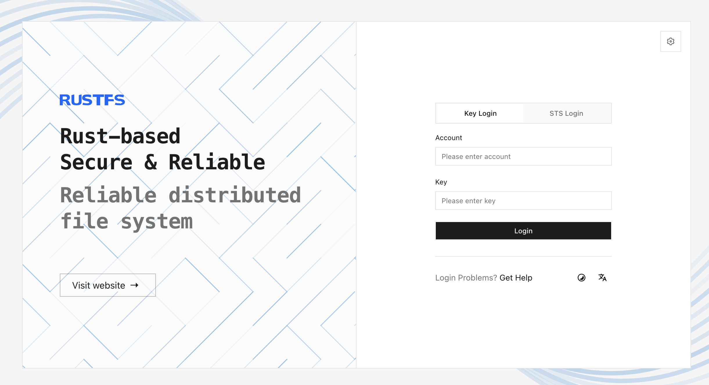

The **RustFS Console** is the web administration interface for RustFS. Use this page to enable the Console, open the login page, and choose the appropriate sign-in method. Detailed procedures for buckets, objects, and identity management are covered in their respective documentation sections.

## Enable the Console

The Console is enabled by default and listens on port `9001`, separately from the S3 API on port `9000`. You can set the behavior explicitly with the following environment variables:

```ini title="/etc/default/rustfs"
RUSTFS_CONSOLE_ENABLE=true
RUSTFS_CONSOLE_ADDRESS=":9001"
```

Restart RustFS after changing these values. Set `RUSTFS_CONSOLE_ENABLE=false` when the Console must not run.

The equivalent command-line options are `--console-enable` and `--console-address`. See the [CLI reference](/reference/cli) and [environment variable reference](/reference/environment-variables) for the complete server configuration.

## Open the Console

Open the following address, replacing `<server-ip>` with the RustFS server address:

```text
http://<server-ip>:9001
```



For a local deployment, use `http://localhost:9001`. Windows and macOS desktop launchers use port `7001` instead.

If the login page cannot reach the target RustFS service, select **Server Configuration** or open `/config`. Enter the externally reachable RustFS service address and save it after the health check succeeds. **Reset** clears the saved address; **Skip** returns to login without changing it.

## Log in

The login methods shown depend on the deployment configuration:

- **Key Login** uses the access key and secret key configured for the RustFS deployment. This is the standard login method for a local administrator.
- **STS Login** uses temporary Security Token Service (STS) credentials. Use it only when your identity workflow has issued a valid session token.
- **OIDC Login** appears when an OpenID Connect (OIDC) provider is configured. Select the provider and complete authentication with the identity provider.

After login, the Console opens the first page your account can access. Menus and actions vary by account policy and enabled platform capabilities; a missing menu does not necessarily indicate a Console error.

If login fails, verify the selected login method, credentials, target server address, and account status before retrying.

:::warning[Do not expose default credentials]

RustFS falls back to `rustfsadmin` / `rustfsadmin` when custom credentials are not configured. Use these defaults only for a throwaway local test. Configure a unique access key and a strong secret key before making the Console reachable by other users.

:::

## Operational notes

- Use [TLS](/integration/tls-configured) before exposing the Console outside a trusted network.
- Restrict network access to the Console listener and configure [Console CORS](/administration/cors) only when cross-origin access is required.
- The Console session inherits the permissions of the signed-in identity. Use a least-privilege account for routine work.
- Signing out or an expired session returns you to the login page. Do not store administrator credentials in shared browsers.

## Management workflows

- [Create and manage buckets](/administration/data/bucket/creation)
- [Upload and manage objects](/administration/data/object/creation)
- [Manage access keys](/security-compliance/iam/access-token)
- [Configure identity and access management](/security-compliance/iam)

## Next steps

Review the [security checklist](/installation/requirement/checklists/security-checklists) before exposing the Console outside a trusted network. For OIDC-based login, continue with the [OIDC configuration guide](/security-compliance/oidc).