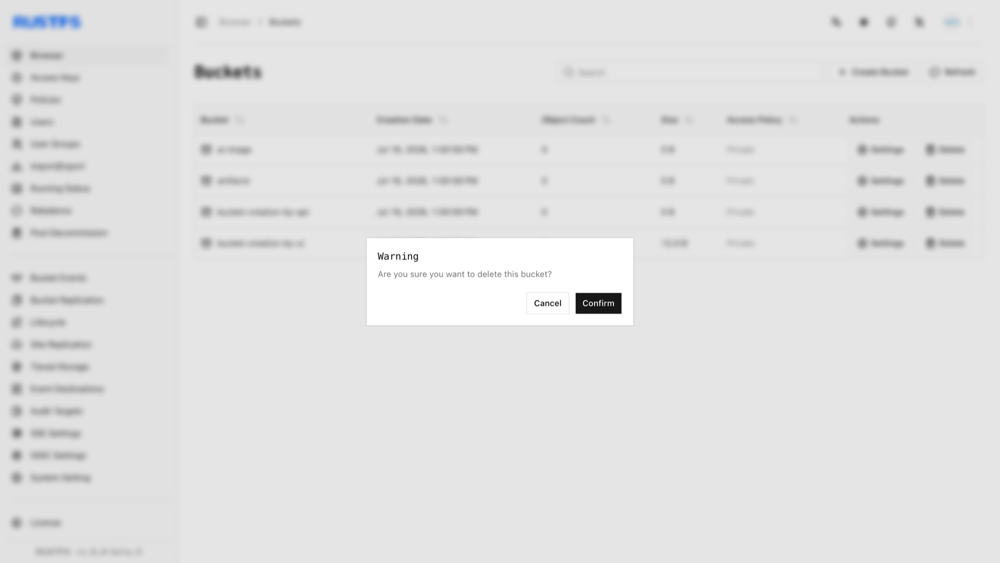

This guide explains how to delete buckets using the RustFS UI, `rc`, or the S3 API.

## Requirements

- Install and configure [`rc`](/operations/rc) before using the command-line workflow.
- Empty the target bucket before deleting it, or use `--force` only after reviewing the objects that will be removed.

**Warning**: Deleting a bucket is irreversible and may break applications relying on it. Ensure you have backed up any necessary data before proceeding.

## Using the RustFS UI

1. Log in to the RustFS Console.
2. On the homepage, select the bucket you want to delete.
3. On the far right, select the **Delete** button.
4. In the popup dialog, click **Confirm** to complete bucket deletion.



## Using `rc`

See the [`rc` guide](/operations/rc) for installation and alias configuration.

Delete a bucket:

```bash
rc bucket remove rustfs/my-bucket
```

```text
✓ Bucket 'rustfs/my-bucket' removed successfully.
```

## Using the API

Delete a bucket via API:

```http
DELETE /{bucketName} HTTP/1.1
```

S3 requests must be signed with AWS Signature V4, so use an S3 client rather than hand-crafting headers. With the [AWS CLI](https://docs.aws.amazon.com/cli/latest/userguide/getting-started-install.html) configured for your access keys:

```bash
aws s3api delete-bucket \
  --bucket bucket-creation-by-api \
  --endpoint-url http://localhost:9000
```

Verify the bucket deletion in the RustFS Console.
