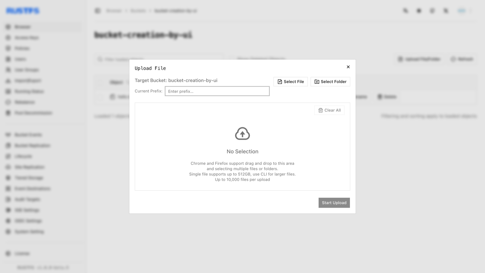
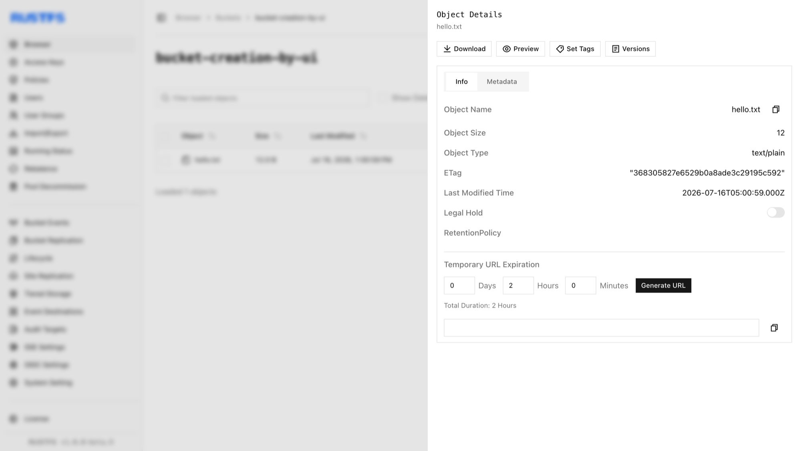

Objects are the fundamental storage units in RustFS, containing data, metadata, and a unique key. This guide covers object creation (upload).

## Requirements

- A running RustFS instance (see [Installation Guide](../../../installation/index.md)).
- [`rc`](/operations/rc) installed and configured with an alias for the command-line workflow.
- A target bucket. Create one by following [Bucket Creation](../bucket/creation.md).

## Creating Objects

### Using the RustFS UI

1. Log in to the RustFS Console.
2. Select the target bucket.
3. On the bucket page, in the top right corner, select **New Directory**, **New File**, or **Upload File/Folder**.
4. To upload from your local machine, click **Upload File/Folder**, select the files, and click **Start Upload**.



Click on an object to view its details.



### Using `rc`

See the [`rc` guide](/operations/rc) for installation and alias configuration.

Upload a file:

```bash
rc object copy /path/to/hello.txt rustfs/my-bucket/hello.txt
rc object list rustfs/my-bucket
```

Verify the upload in the RustFS Console.

### Using the API

Upload a file via API:

```http
PUT /{bucketName}/{objectName} HTTP/1.1
```

S3 requests must be signed with AWS Signature V4, so use an S3 client rather than hand-crafting headers. With the [AWS CLI](https://docs.aws.amazon.com/cli/latest/userguide/getting-started-install.html) configured for your access keys:

```bash
aws s3api put-object \
  --bucket bucket-creation-by-api \
  --key hello.txt \
  --body /path/to/hello.txt \
  --endpoint-url http://localhost:9000
```

Verify the upload in the RustFS Console.

## Deleting Objects

See [Object Deletion](./deletion.md).

Use the following API for file deletion:

```http
DELETE /{bucketName}/{objectName} HTTP/1.1
```

Request example:

```bash
aws s3api delete-object \
  --bucket bucket-creation-by-api \
  --key hello.txt \
  --endpoint-url http://localhost:9000
```

You can confirm the file has been deleted on the RustFS UI.
