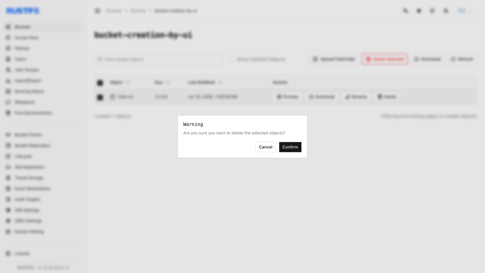

This guide covers object deletion.

## Requirements

- Install and configure [`rc`](/operations/rc) before using the command-line workflow.
- Confirm the alias, bucket, and object key before deleting an object.

## Using the RustFS UI

1. Log in to the RustFS Console.
2. Select the bucket containing the file to be deleted.
3. On the bucket page, select the file to be deleted.
4. Click **Delete Selected Items** in the upper right corner, then click **Confirm** in the popup dialog.



## Using `rc`

Delete a file:

```bash
rc object remove rustfs/my-bucket/hello.txt
rc object list rustfs/my-bucket
```

```text
Removed: rustfs/my-bucket/hello.txt
✓ Removed 1 object(s).
```

Verify the deletion in the RustFS Console.

## Using the API

Delete a file via API:

```http
DELETE /{bucketName}/{objectName} HTTP/1.1
```

S3 requests must be signed with AWS Signature V4, so use an S3 client rather than hand-crafting headers. With the [AWS CLI](https://docs.aws.amazon.com/cli/latest/userguide/getting-started-install.html) configured for your access keys:

```bash
aws s3api delete-object \
  --bucket bucket-creation-by-api \
  --key hello.txt \
  --endpoint-url http://localhost:9000
```

Verify the deletion in the RustFS Console.
