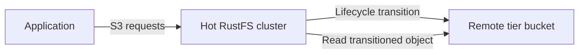

RustFS tiered storage moves objects from local storage to a configured remote backend. This page explains the supported targets and shows how to add and maintain a RustFS tier in the Console.

Tiering is asynchronous. RustFS keeps the object metadata locally, transfers the object data to the remote tier, and continues to serve S3 reads through the original bucket and object key.



:::note[Tier names are not AWS storage classes]

Lifecycle rules refer to a registered tier by its uppercase name, such as `COLDTIER`. Do not substitute AWS class labels such as `INTELLIGENT_TIERING`, `GLACIER`, or `DEEP_ARCHIVE` unless you have registered a RustFS tier with that exact valid name and verified the target behavior.

:::

## Supported backends

The RustFS source defines warm-backend implementations for these target types:

| Type | Configuration key | Typical target |
| --- | --- | --- |
| RustFS | `rustfs` | Another RustFS deployment |
| S3 | `s3` | Amazon S3 or an S3 endpoint supported by this backend |
| Wasabi | `wasabi` | Wasabi object storage |
| MinIO | `minio` | A MinIO deployment |
| Aliyun | `aliyun` | Alibaba Cloud Object Storage Service (OSS) |
| Tencent | `tencent` | Tencent Cloud Object Storage (COS) |
| Huaweicloud | `huaweicloud` | Huawei Cloud Object Storage Service (OBS) |
| Azure | `azure` | Azure Blob Storage |
| GCS | `gcs` | Google Cloud Storage |
| R2 | `r2` | Cloudflare R2 |

Provider payloads and credential requirements differ. The complete workflow below uses the RustFS backend because the RustFS source includes an end-to-end hot-cluster-to-cold-cluster test for this path.

## Before you begin

Prepare the following:

- A source RustFS deployment that stores the hot data.
- A separate target RustFS deployment and an existing target bucket. This example uses `my-bucket` on the target.
- Target credentials with permission to put, get, list, and delete objects in that bucket.
- Access to the source deployment's RustFS Console.

Use TLS for both deployments in production. Restrict the target credentials to the dedicated tier bucket and prefix.

## 1. Open Tiered Storage

Sign in to the source deployment's RustFS Console. In the left navigation, select **Tiered Storage**, then select **Add Tier** in the upper-right corner.

## 2. Select the target

Select the target provider. This example uses **RustFS** to connect the source deployment to another RustFS deployment.

## 3. Enter the target details

Complete the form:

| Field | Value |
| --- | --- |
| **Name (A-Z,0-9,_)** | Enter a unique uppercase tier name, such as `COLDTIER`. |
| **Endpoint** | Enter the target RustFS S3 endpoint. |
| **Access Key** | Enter the access key for the target deployment. |
| **Secret Key** | Enter the secret key for the target deployment. |
| **Bucket** | Enter the existing target bucket name, such as `my-bucket`. |
| **Prefix (Optional)** | Optionally enter a prefix dedicated to tiered objects. |
| **Region** | Optionally enter the target region, such as `us-east-1`. |

Leave **Storage Class** at its default unless the target backend requires a different supported storage class.

:::warning[Protect tier credentials]

The form contains a secret key. Use credentials restricted to the target bucket and prefix. Do not expose the key in screenshots, tickets, or logs.

:::

## 4. Save the tier

Select **Save**. RustFS validates the backend and probes it by writing, reading, and removing a small object. Saving fails when the endpoint, credentials, bucket permissions, or backend configuration cannot complete that probe.

After the tier appears in the **Tiers** list, configure a transition rule in [Lifecycle Management](/administration/data/lifecycle-management). A registered tier does not move objects until a lifecycle rule references its name.

## Manage tiers with `rc`

Install and configure [`rc`](/operations/rc), then list the tiers registered on the source deployment:

```bash
rc bucket lifecycle tier list local
```

Add a RustFS tier with the same settings described in the Console workflow:

```bash
rc bucket lifecycle tier add rustfs COLDTIER local \
  --endpoint <target-rustfs-endpoint> \
  --access-key <your-access-key> \
  --secret-key <your-secret-key> \
  --bucket my-bucket \
  --region us-east-1
```

Inspect the tier configuration and available statistics:

```bash
rc bucket lifecycle tier info COLDTIER local
```

The remaining tier commands update credentials or remove a tier:

```bash
rc bucket lifecycle tier edit COLDTIER local \
  --access-key <your-access-key> \
  --secret-key <your-secret-key>
rc bucket lifecycle tier remove COLDTIER local
```

See [Lifecycle Management](/administration/data/lifecycle-management) to create transition rules, confirm transitions, and restore local copies. Run `rc bucket lifecycle tier <command> --help` to inspect provider-specific options before changing a tier.

## Monitor tier activity

Use the tier statistics endpoint with a SigV4-signed request and `admin:ListTier` permission:

```http
GET /rustfs/admin/v3/tier-stats?tier=COLDTIER HTTP/1.1
Host: <hot-rustfs-endpoint>
```

Monitor transition failures together with source-cluster capacity and target-side availability. A configured tier adds the target service and network path to the read path for objects that do not have a restored local copy.

## Change or remove a tier

The Admin API exposes these mutation routes, all requiring `admin:SetTier`:

| Operation | Route |
| --- | --- |
| Edit a tier | `POST /rustfs/admin/v3/tier/{tiername}` |
| Remove a tier | `DELETE /rustfs/admin/v3/tier/{tiername}` |
| Clear all tiers | `POST /rustfs/admin/v3/tier/clear` |

Before editing or removing a tier:

1. Disable lifecycle rules that reference the tier.
2. Confirm that no transition jobs are still using it.
3. Confirm that no source objects depend on data stored in its target bucket or prefix.
4. Back up the tier configuration and record the target location.

Normal tier mutations check backend usage and protect non-empty targets. Do not use a `force` option to bypass those checks unless you have independently proved that every transitioned object remains recoverable. Removing configuration for an active tier can make transitioned objects unreadable from the source cluster.

:::warning[Do not modify tier objects directly]

Do not rename, overwrite, or delete generated objects in the target bucket. Manage source objects through the hot RustFS cluster so RustFS can keep local transition metadata and remote data consistent.

:::

## Admin API reference

The current RustFS source registers these tier routes:

| Method | Route | Permission |
| --- | --- | --- |
| `PUT` | `/rustfs/admin/v3/tier` | `admin:SetTier` |
| `POST` | `/rustfs/admin/v3/tier/{tiername}` | `admin:SetTier` |
| `DELETE` | `/rustfs/admin/v3/tier/{tiername}` | `admin:SetTier` |
| `POST` | `/rustfs/admin/v3/tier/clear` | `admin:SetTier` |
| `GET` | `/rustfs/admin/v3/tier` (list configurations) | `admin:ListTier` |
| `GET` | `/rustfs/admin/v3/tier/{tier}` (verify connectivity) | `admin:ListTier` |
| `GET` | `/rustfs/admin/v3/tier-stats` (read statistics) | `admin:ListTier` |

All Admin API requests require SigV4 authentication. These routes are an administrative interface, not ordinary S3 bucket operations.

## Next steps

Review [lifecycle management](/administration/data/lifecycle-management) and configure [access policies](/security-compliance/iam/policies) for the administrators and service credentials used by tiered storage.