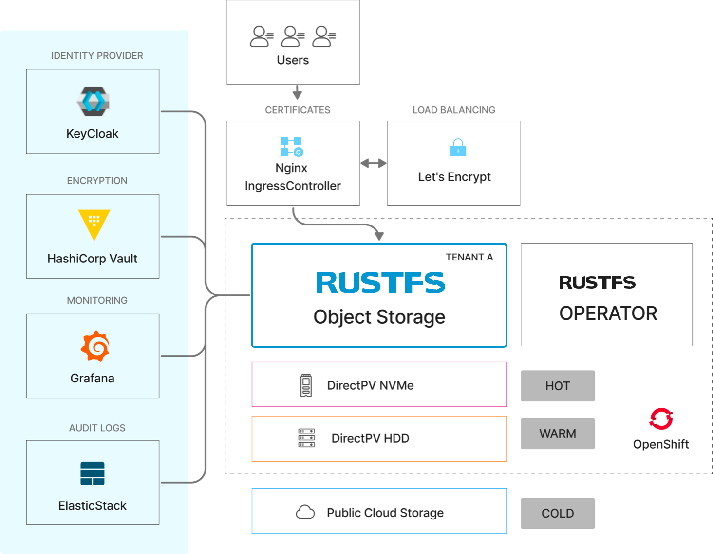

# RustFS für Huawei Cloud CCE Kubernetes Service

## Drei Gründe, warum Kunden RustFS auf Huawei Cloud betreiben

- RustFS fungiert als konsistente Speicherschicht in Hybrid- oder Multi-Cloud-Bereitstellungsszenarien
- RustFS ist ein Kubernetes-natives Hochleistungsprodukt, das vorhersagbare Leistung in öffentlichen, privaten und Edge-Cloud-Umgebungen bieten kann
- Das Betreiben von RustFS auf CCE ermöglicht die Kontrolle über den Software-Stack und bietet die Flexibilität, die zur Vermeidung von Vendor-Lock-in erforderlich ist

Huawei Cloud CCE ist ein verwalteter Service, der zum Ausführen von Kubernetes auf Huawei Cloud verwendet werden kann, ohne dass Sie Ihre eigene Kubernetes-Steuerungsebene oder -Knoten installieren, betreiben und warten müssen.

RustFS bietet ein portables Hochleistungs-Objektspeichersystem auf allen wichtigen Kubernetes-Plattformen (Alibaba Cloud ACK, Tanzu, Azure, GCP, Huawei Cloud CCE). Auf Huawei Cloud ist RustFS nativ in den Huawei Cloud CCE-Service integriert, wodurch es einfacher wird, Ihren eigenen großskaligen Multi-Tenant-Objektspeicher als Service zu betreiben. RustFS ist ein vollständiger Ersatz für AWS S3 Storage as a Service.

Im Gegensatz zu AWS S3 ermöglicht RustFS Anwendungen, sich über Multi-Cloud- und Hybrid-Cloud-Infrastrukturen zu skalieren, ohne teure Software-Umschreibungen oder proprietäre Integrationen. Da RustFS containerisiert und Kubernetes-nativ ist, kann es auf diesen Plattformen bereitgestellt werden, ohne dass spezialisierte Fähigkeiten zum Betreiben großskaliger Speicherinfrastrukturen erforderlich sind.

## RustFS Operator nativ in Huawei Cloud CCE-Funktionen integriert

### Funktionsübersicht

- **Speicherklassen und Tiering**
- **Externes Load Balancing**
- **Verschlüsselungsschlüsselverwaltung**
- **Identitätsverwaltung**
- **Zertifikatsverwaltung**
- **Überwachung und Alarmierung**
- **Protokollierung und Audit**

## Speicherklassen und Tiering

Eine wichtige Anforderung für die großskalige Bereitstellung von RustFS auf Huawei Cloud CCE ist die Fähigkeit, über Speicherklassen (NVMe, HDD, öffentliche Cloud) zu tiern. Dies ermöglicht es Unternehmen, Kosten und Leistung gleichzeitig zu verwalten.

RustFS unterstützt den automatischen Übergang alternder Objekte von der schnellen NVMe-Schicht zu kosteneffizienteren HDD-Schichten oder sogar zu kostengünstigen kalten öffentlichen Cloud-Speicherschichten.

Beim Tiering bietet RustFS einen einheitlichen Namespace über Schichten hinweg. Bewegungen über Schichten hinweg sind für Anwendungen transparent und werden durch vom Kunden bestimmte Richtlinien ausgelöst.

RustFS bietet sicheren Speicher in der Huawei Cloud CCE Hybrid-Cloud durch Verschlüsselung von Objekten an der Quelle und stellt sicher, dass Kunden immer die vollständige Kontrolle über ihre Daten haben. Wenn Huawei Cloud CCE in der öffentlichen Cloud bereitgestellt wird, hilft die Tiering-Funktion Huawei Cloud CCE, Daten effektiv über persistente Block-Speicher und günstigere Objektspeicherschichten zu verwalten.

**Mehr erfahren:**

## Externes Load Balancing

Alle Kommunikation von RustFS basiert auf HTTP, RESTful API und unterstützt jeden standardmäßigen Kubernetes-kompatiblen Ingress-Controller. Dies umfasst sowohl hardware- als auch software-definierte Lösungen. Die beliebteste Wahl ist NGINX. Installieren Sie über OperatorHub oder OpenShift Marketplace und verwenden Sie dann Annotations, um RustFS-Tenants zu exponieren.

## Verschlüsselungsschlüsselverwaltung

Es gibt keine nativen OpenShift-Schlüsselverwaltungsfunktionen. Daher empfiehlt RustFS die Verwendung von HashiCorp Vault zum Speichern von Schlüsseln außerhalb des Objektspeichersystems. Dies ist eine Best Practice für Cloud-native Anwendungen.

Für alle Produktionsumgebungen empfehlen wir, standardmäßig Verschlüsselung auf allen Speicher-Buckets zu aktivieren. RustFS verwendet AES-256-GCM oder ChaCha20-Poly1305-Verschlüsselung zum Schutz der Datenintegrität und -vertraulichkeit mit vernachlässigbaren Auswirkungen auf die Leistung.

RustFS unterstützt alle drei Server-Side-Encryption-Modi (SSE-KMS, SSE-S3 und SSE-C). SSE-S3 und SSE-KMS sind mit dem serverseitigen KMS integriert, während SSE-C clientseitig bereitgestellte Schlüssel verwendet.

RustFS wird dieses KMS verwenden, um seinen internen Schlüsselverschlüsselungsserver (KES-Service) für hochperformante pro-Objekt-Verschlüsselung zu bootstrappen. Jeder Tenant führt seinen eigenen KES-Server in einem isolierten Namespace aus.

## Identitätsverwaltung

Beim Betreiben von RustFS auf OpenShift können Kunden Single Sign-On (SSO) über Drittanbieter-OpenID Connect/LDAP-kompatible Identitätsanbieter wie Keycloak, Okta/Auth0, Google, Facebook, ActiveDirectory und OpenLDAP verwalten. RustFS empfiehlt den OpenID Connect-kompatiblen Keycloak IDP.

Externe IDPs ermöglichen es Administratoren, Benutzer-/Anwendungsidentitäten zentral zu verwalten. RustFS baut auf dem IDP auf und bietet AWS IAM-ähnliche Benutzer-, Gruppen-, Rollen-, Richtlinien- und Token-Service-APIs. Die Fähigkeit einer von der Infrastruktur unabhängigen einheitlichen Identitäts- und Zugriffsverwaltung (IAM)-Schicht bietet erhebliche architektonische Flexibilität.

## Zertifikatsverwaltung

Der gesamte Datenverkehr von Anwendungen zu RustFS, einschließlich Knoten-zu-Knoten-Datenverkehr, wird mit TLS verschlüsselt. TLS-Zertifikate werden zum Schutz der Netzwerkkommunikation und zur Etablierung der Identität von Netzwerkverbindungsressourcen wie RustFS-Serverdomänen verwendet.

RustFS ist in den OpenShift-Zertifikatsmanager integriert, sodass Sie den RustFS-Operator verwenden können, um Zertifikate für RustFS-Tenants automatisch zu konfigurieren, zu verwalten und zu aktualisieren. Tenants sind vollständig voneinander isoliert in ihren eigenen Kubernetes-Namespaces mit eigenen Zertifikaten für erhöhte Sicherheit.

## Überwachung und Alarmierung

RustFS empfiehlt die Verwendung von Grafana, den in OpenShift-user-workload-monitoring installierten Plattformüberwachungskomponenten oder anderen OpenShift-Containerüberwachungstools zur Verbindung mit RustFS. RustFS veröffentlicht alle vorstellbaren speicherbezogenen Prometheus-Metriken, von Speicher-Bucket-Kapazität bis zu Zugriffsmetriken. Diese Metriken können in jedem Prometheus-kompatiblen Tool oder in der RustFS-Konsole gesammelt und visualisiert werden.

Externe Überwachungslösungen scrapen regelmäßig den RustFS Prometheus-Endpunkt. RustFS empfiehlt die Verwendung von Grafana oder den in OpenShift-user-workload-monitoring installierten Plattformüberwachungskomponenten zur Verbindung mit RustFS. Dieselben Tools können auch verwendet werden, um Baselines zu etablieren und Benachrichtigungsalarmschwellenwerte festzulegen, die dann an Benachrichtigungsplattformen wie PagerDuty, Freshservice oder sogar SNMP weitergeleitet werden können.

## Protokollierung und Audit

Die Aktivierung des RustFS-Audits generiert Protokolle für jeden Vorgang im Objektspeichercluster. Zusätzlich zu Audit-Protokollen protokolliert RustFS auch Konsolenfehler für operative Fehlerbehebung.

RustFS unterstützt die Ausgabe von Protokollen an den Elastic Stack (oder Drittanbieter) zur Analyse und Alarmierung.
