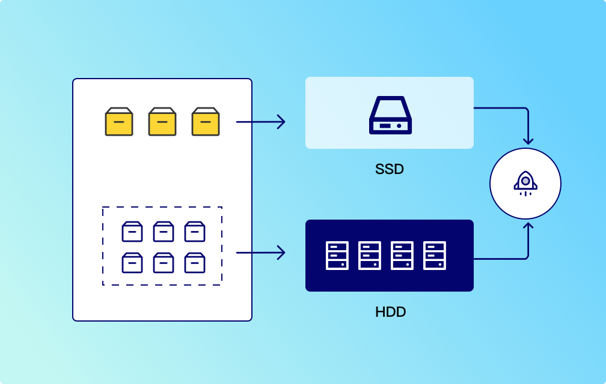
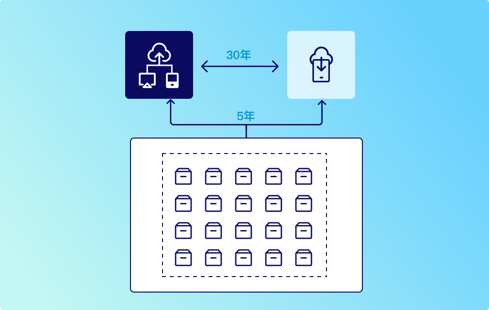

# Industrielle Produktions-Lösungen

Langzeitspeicherung, Qualitätskontrolle, Nachverfolgung und andere massive Datenmengen in der industriellen Produktion für Kostensenkung und Effizienzsteigerung

## Vier Kernschmerzen der industriellen Produktion

| Schmerzpunkt | Spezifische Szenarien/Herausforderungen | Benutzeranforderungen |
|--------------|----------------------------------------|----------------------|
| **Massive Datenspeicherung & Skalierbarkeit** | Sensoren und Geräte in der industriellen Produktion generieren PB-Level-Daten, traditionelle Speicher sind schwer zu erweitern und teuer. | Elastische Speicherkapazitätserweiterung, dynamisches Wachstum, reduzierte Hardware-Investitionen und Wartungskosten. |
| **Echtzeitverarbeitung & Niedrige Latenz** | Echtzeitmonitoring, prädiktive Wartung und andere Szenarien benötigen Millisekunden-Datenread/write, traditionelle Speicher haben hohe Latenz, beeinträchtigen Entscheidungseffizienz. | Hohe parallele Read/Write-Fähigkeit, Unterstützung für Echtzeit-Datenanalyse und Edge-Computing, verkürzte Antwortzeiten. |
| **Datensicherheit & Compliance** | Industrielle Daten beinhalten Kernverfahrensparameter, müssen GDPR, ISO 27001 und andere Vorschriften erfüllen, Leckage und Manipulation verhindern. | Ende-zu-Ende-Verschlüsselung, feingranulige Berechtigungskontrolle, Audit-Logs, Gewährleistung der Compliance über den gesamten Datenlebenszyklus. |
| **Multi-Source heterogene Datenintegration** | Industrielle Umgebungen haben mehrere Protokolle/Formate wie S3, NFS, Datenbanken, verteilte Speicherung führt zu komplexer Verwaltung und niedriger Auslastung. | Einheitliche Speicherplattform kompatibel mit Multi-Protokoll-Zugang, zentralisierte Datenverwaltung und nahtlose Systemübergreifende Aufrufe. |

## Lösungsansätze

### SSD- und HDD-Tiered-Storage zur Kostensenkung

SSDs bieten schnelle Read/Write-Geschwindigkeiten, geeignet für Anwendungen mit hohen I/O-Performance-Anforderungen, während HDDs kostengünstiger sind und für große Kapazitätsspeicherung geeignet. Durch Speicherung häufig genutzter Daten auf SSDs und seltener genutzter Daten auf HDDs können Kosten gesenkt werden, ohne die Performance zu beeinträchtigen.

#### Kernvorteile des Tiered Storage

- **Performance ohne Kompromisse**: Erreicht geschäftsnotwendige SSD-Beschleunigung
- **Halbierte Kosten**: HDD verwendet 70% Performance-Daten
- **Automatische Wartung**: AI-Vorhersage des Datenlebenszyklus
- **Elastische Erweiterung**: On-Demand-Skalierung + integrierter Cloud-Zugang
- **Risikodiversifikation**: Medien-Backup + Datenspiegelung
- **Grün und kohlenstoffarm**: Energiesparend + kohlenstoffarme Nutzung

#### SSD für Performance, HDD für Kostensenkung - intelligente Schichtung für "guten Stahl an der Schneide"

#### SSD+HDD Tiered Storage vs. Einzelspeicher-Lösung Kostenvergleich

| Vergleichsitem | Reine SSD-Lösung | Reine HDD-Lösung | Tiered-Storage-Lösung |
|----------------|------------------|------------------|------------------------|
| **Speichermedienkosten** | Extrem hoch ($6~8/GB) | Extrem niedrig ($0.03/GB) | Hybridkosten (SSD speichert nur 20% heiße Daten) |
| **Performance** | 0.1ms Latenz | 8~10ms Latenz | Heiße Daten 0.15ms, kalte Daten nach Bedarf |
| **Energieverbrauch (1PB/Jahr)** | 250k kWh | 300k kWh | 120k kWh (SSD niedrig + HDD Ruhezustand) |
| **Kapazitätserweiterungskosten** | Gesamterweiterung erforderlich | Performance-Engpass | Schichtweise Erweiterung (z.B. nur HDD-Schicht) |
| **5-Jahr TCO (Gesamtkosten)** | $6.7M | $2.0M | $2.65M (60% Einsparung vs SSD) |
| **Geeignete Szenarien** | Echtzeit-Trading, High-Frequency R/W | Archivierung, Backup | 90% Enterprise-Hybrid-Workloads (DB/Dateidienste) |

### Kaltspeicher zur Kostensenkung

Verglichen mit traditioneller Bandspeicherung haben Blu-ray-Discs niedrigere Speicherkosten, besonders bei großen Mengen. Die Kosteneffizienz der Blu-ray-Technologie macht sie zur idealen Wahl für groß angelegte Datenarchivierung.

Blu-ray-Speichergeräte haben während des Betriebs viel niedrigeren Energieverbrauch als Festplatten (HDD) oder Solid-State-Drives (SSD), was niedrigere Energiekosten bedeutet.

#### Kernvorteile der Kaltspeicherung

- **Niedrigere Kosten**: Blu-ray-Disc-Kosten pro GB nur 15% der ursprünglichen Festplatten-Lösung
- **Langzeit-Zuverlässigkeit**: Keine regelmäßige Datenmigration erforderlich
- **Compliance-Sicherheit**: Militärischer Verschlüsselungsschutz

#### Kaltspeicherung durch intelligente Schichtung und elastische Erweiterung reduziert Kosten für Archivierung niederfrequenter Industriedaten um 60%, balanciert Sicherheits-Compliance und effiziente Ressourcennutzung

#### Kostenvergleich (1PB/5 Jahre)

| Medium | Gesamtkosten | Energieverbrauch | Lebensdauer |
|--------|--------------|------------------|-------------|
| **Blu-ray-Speicher** | ¥2.2M | 1200 kWh | 50+ Jahre |
| **Magnetband** | ¥3.0M | 2800 kWh | 30 Jahre |
| **HDD-Serie** | ¥4.93M | 6500 kWh | 5 Jahre |

### Multi-Cloud-Transformation zur Kostensenkung

Cloud-Speicher erreicht Kostensenkung und Effizienzsteigerung durch Integration und dynamische Planung von Datenressourcen, bedarfsgerechte Zuteilung von Kalt-/Heißdaten-Speichernetzwerken. Basierend auf den Lösungen jedes Cloud-Anbieters, nutzt standardisierte Schnittstellen für nahegelegene optimale Pfade, optimiert Ausgaben durch kombinierte reservierte/elastische Instanzen.

Gleichzeitig unterstützt es industrielle IoT-Daten, Service-Imaging und andere unstrukturierte Daten sowie atomare Daten-Cloud- und Edge-Computing. Basierend auf Geschäftskontinuität reduziert es Speicherkosten um 20%~40% und baut die kosteneffizienteste Infrastruktur auf.

#### Kernvorteile der Multi-Cloud-Transformation

- **Patentierter Cross-Cloud-Scheduling-Algorithmus**: Kritische Geschäftselastische SSD-Beschleunigung
- **30% Kosteneinsparungsversprechen**: HDD trägt 70% niederfrequente Daten
- **8 große branchenfertige Lösungen**: AI-Vorhersage des Datenlebenszyklus

### Technologie-Wert-Pyramide

Basierend auf militärischer Zuverlässigkeit und unbegrenzt erweiterbarer verteilter Objektspeicher-Technologie, erreicht verlustfreie intelligente Produktion der gesamten industriellen Datenkette, unterstützt AI-Qualitätskontrolle und globale Lieferkettenkoordination in Echtzeit, treibt Fertigungsunternehmen zur agilen Evolution zu Industrie 4.0 voran

