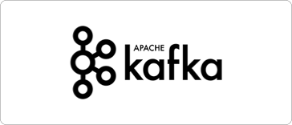
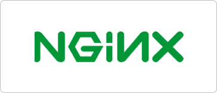

# Integration mit RustFS

Moderne Data Stacks sind vernetzte Data Stacks. Durchsuchen Sie unsere umfangreiche Integrationsliste mit Links zur relevanten Dokumentation.

## Übersicht der Integrationstypen

- 👥 [Externe Identitätsanbieter](#externe-identitätsanbieter) - Single Sign-On Identitätsmanagement
- 🔐 [Externes Schlüsselmanagement](#externes-schlüsselmanagement) - Zentralisierte Verschlüsselungsschlüsselverwaltung
- 📊 [Überwachung und Alarmierung](#überwachung-und-alarmierung) - Kontinuierliche Ereignisüberwachung
- 🔔 [Benachrichtigungsziele](#benachrichtigungsziele) - Ereignisbenachrichtigungsdienste
- 🌐 [Föderation](#föderation) - Rechenzentren-übergreifende Authentifizierung
- ⚙️ [Orchestratoren](#orchestratoren) - Cloud-native Orchestrierungsplattformen
- ⚖️ [Load Balancer](#load-balancer) - Traffic-Verteilung und -Management
- ☁️ [Hybrid Cloud](#hybrid-cloud) - Multi-Cloud-Umgebungsunterstützung
- 🤖 [Maschinelles Lernen und Big Data](#maschinelles-lernen-und-big-data) - AI/ML Framework-Integration
- 💾 [Backup](#backup) - Datensicherungslösungen

---

## Externe Identitätsanbieter

Vertrauenswürdige Identitätsanbieter sind Schlüsselkomponenten von Single Sign-On. RustFS unterstützt Anwendungs- und Benutzeridentitäten durch die folgenden Integrationen.

| | | |
|---|---|---|
|  |  |  |

## Externes Schlüsselmanagement

Key Management Service (KMS) ermöglicht es Ihnen, Verschlüsselungsschlüssel einfach zu erstellen und zu verwalten sowie deren Nutzung in Ihrer gesamten Organisation zentral zu steuern.

| | |
|---|---|
|  |  |

## Überwachung und Alarmierung

Container und Microservices erfordern kontinuierliche Ereignisüberwachung und Alarmierung. Behalten Sie jede cloud-native Anwendung oder Infrastruktur durch diese Integrationen im Auge.

| | | | |
|---|---|---|---|
|  |  |  |  |

## Benachrichtigungsziele

Ereignisbenachrichtigungen sind zentral für die operative Schärfe jedes Systems. RustFS protokolliert alle Objektoperationen für Lambda Computing, Objektsuche, Analytik und Sicherheitsprüfung.

| | | | |
|---|---|---|---|
|  |  |  |  |

## Föderation

Wenn verteilte Bereitstellungen Rechenzentren und geografische Standorte umspannen, werden zentrale föderierte Authentifizierungsdienste benötigt. RustFS integriert sich mit den folgenden.

| | |
|---|---|
|  |  |

## Orchestratoren

RustFS unterstützt moderne cloud-native Orchestrierungsplattformen für vollständig automatisierte Bereitstellung und Verwaltung physischer Ressourcen (CPU, Netzwerk und Laufwerke).

| | | |
|---|---|---|
|  |  |  |

## Load Balancer

Für öffentlich zugängliche Infrastrukturen bieten Load Balancer die folgenden Dienste: Routing, Service Discovery, SSL-Terminierung und Traffic-Shaping. RustFS integriert sich mit den folgenden.

| | | | |
|---|---|---|---|
|  |  |  |  |

## Hybrid Cloud

RustFS lässt bestehende Infrastruktur von On-Premises-Bereitstellungen bis hin zu öffentlichen Clouds wie Amazon S3 aussehen. Zusätzlich fügt es CDN-Caching-Funktionalität vor öffentlichen Clouds hinzu, um Bandbreite zu sparen und gleichzeitig hohe Leistung zu bieten.

| | | | |
|---|---|---|---|
|  |  |  |  |

## Maschinelles Lernen und Big Data

Moderne Unternehmen sind datengetrieben. RustFS hat native Integrationen mit führenden Analytik- und Machine Learning-Frameworks.

| | | |
|---|---|---|
|  |  |  |
|  |  |  |

## Backup

Objektspeicher mit der AWS S3 API ist zum allgegenwärtigen Backup-Ziel für jede moderne Backup-Anwendung geworden. RustFS integriert sich mit S3-kompatiblen Systemen einschließlich der folgenden führenden Anbieter (die Liste ist lang).

| | | | |
|---|---|---|---|
|  |  |  |  |

