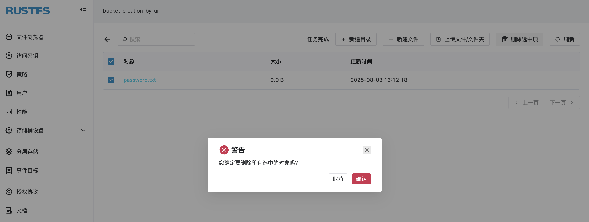

# RustFS Objects

Objects are the basic units of RustFS storage, containing data, metadata, and unique identifiers (Object Key). Data is stored in the form of objects. This chapter introduces object management using file upload and deletion as examples.

> For concepts related to Objects, see the [Core Concepts](../../concepts/glossary.md) chapter.

## Creating Objects

Prerequisites:

- An available RustFS instance. Refer to the [Installation Guide](../../installation/index.md) for installation.

[Create a bucket](../bucket/creation.md), then upload files to the bucket to complete object creation. Files can be uploaded through RustFS UI, `mc`, or API methods.

### Uploading Files on RustFS UI

1. Log into the RustFS UI console.
2. Select the bucket to upload files to.
3. On the bucket page, in the top right corner, select **New Directory**, **New File**, or **Upload File/Folder** to complete file/folder creation.
4. To upload files/folders from local, click the **Upload File/Folder** button, select local files/folders, and click **Start Upload** to complete file upload.


After upload is complete, click on the object to view detailed object information.


### Uploading Files Using `mc`

> For `mc` installation and configuration, see the [`mc` Usage Guide](../../developer/mc.md) chapter.

Use the `mc cp` command to upload files:

```bash
# upload file
mc cp 1.txt rustfs/bucket-creation-by-mc
/tmp/1.txt:            13 B / 13 B  ▓▓▓▓▓▓▓▓▓▓▓▓▓▓▓▓▓▓▓▓▓▓▓▓▓▓▓▓▓▓▓▓▓▓▓▓▓▓▓  61 B/s 0s%

# confirm file uploaded
mc ls rustfs/bucket-creation-by-mc
[2025-08-01 10:01:08 CST]    13B 1.txt
```

After upload is complete, you can view it on the RustFS console.

### Uploading Files Using API

Use the following API for file upload:

```
PUT /{bucketName}/{objectName} HTTP/1.1
```

Request example:

```bash
curl --location --request PUT 'http://12.34.56.78:9000/bucket-creation-by-api/password.txt' \
--header 'Content-Type: text/plain' \
--header 'X-Amz-Content-Sha256: e3b0c44298fc1c149afbf4c8996fb92427ae41e4649b934ca495991b7852b855' \
--header 'X-Amz-Date: 20250801T024840Z' \
--header 'Authorization: AWS4-HMAC-SHA256 Credential=H4xcBZKQfvJjEnk3zp1N/20250801/cn-east-1/s3/aws4_request, SignedHeaders=content-length;content-type;host;x-amz-content-sha256;x-amz-date, Signature=b7d8dc29ee34dfdf1f3e9e8e069892a8936f478586e7a2c90cf34f5b86d3a2dc' \
--data-binary '@/path/to/password.txt'
```

After upload is complete, you can view it on the RustFS console.

## Deleting Objects

Objects can also be deleted on the UI, using `mc`, or API methods. For example, deleting the files created in the above steps will complete object deletion.

## Deleting Files on RustFS UI

1. Log into the RustFS UI console.
2. Select the bucket containing the file to delete.
3. On the bucket page, select the file to delete.
4. Click **Delete Selected Items** in the top right corner, and click **Confirm** in the popup dialog to complete file deletion.



### Deleting Files Using `mc`

Use the `mc rm` command to delete files:

```bash
# delete file
mc rm rustfs/bucket-creation-by-mc/1.txt
Removed `rustfs/bucket-creation-by-mc/1.txt`.

# confirm deletion
mc ls  rustfs/bucket-creation-by-mc/1.txt
```

You can confirm the file has been deleted on the RustFS UI.

### Deleting Files Using API

Use the following API for file deletion:

```
DELETE /{bucketName}/{objectName} HTTP/1.1
```

Request example:

```bash
curl --location --request DELETE 'http://12.34.56.78:9000/bucket-creation-by-api/password.txt' \
--header 'Content-Type: text/plain' \
--header 'X-Amz-Content-Sha256: e3b0c44298fc1c149afbf4c8996fb92427ae41e4649b934ca495991b7852b855' \
--header 'X-Amz-Date: 20250801T030822Z' \
--header 'Authorization: AWS4-HMAC-SHA256 Credential=H4xcBZKQfvJjEnk3zp1N/20250801/cn-east-1/s3/aws4_request, SignedHeaders=content-length;content-type;host;x-amz-content-sha256;x-amz-date, Signature=1ee63bb0b699598602b2fdbd013e355a57bcb9991307a8ad41f6512e8afebf3a' \
--data-binary '@/Users/jhma/Desktop/password.txt'
```

You can confirm the file has been deleted on the RustFS UI.
