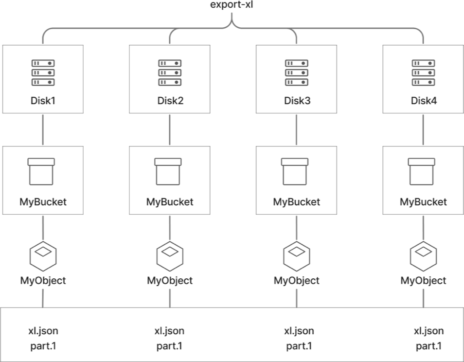

# Despliegue en Bare Metal

Al desplegar RustFS en servidores bare metal, puede maximizar el rendimiento del hardware y lograr la mejor eficiencia de almacenamiento. Esta guía cubre las mejores prácticas para el despliegue en bare metal.

## Requisitos de Hardware

### Configuración Mínima

- **CPU**: 4 núcleos, 2.4GHz o superior
- **Memoria**: 8GB RAM mínimo, 16GB recomendado
- **Almacenamiento**: Al menos 4 unidades para codificación de borrado
- **Red**: Ethernet Gigabit

### Configuración Recomendada

- **CPU**: 16+ núcleos, 3.0GHz o superior
- **Memoria**: 32GB+ RAM
- **Almacenamiento**: 8+ unidades, SSD/HDD mixto para niveles
- **Red**: 10Gb Ethernet o superior

## Arquitectura de Despliegue



### Modo de Nodo Único (SNSD)

Adecuado para entornos de desarrollo y pruebas:

```bash
# Nodo único con una sola unidad
rustfs server /data
```


### Modo Multi-Nodo (MNMD)

Recomendado para entornos de producción:

```bash
# Nodo 1
rustfs server http://server{1...4}/data{1...4} \

# Nodo 2-4 (configuración similar)
```


## Optimización de Rendimiento

### Configuración de Almacenamiento

1. **Selección de Unidades**
   - Use unidades de grado empresarial para producción
   - Considere SSDs NVMe para cargas de trabajo de alto rendimiento
   - Separe las unidades de SO y datos

2. **Configuración RAID**
   - Deshabilite RAID por hardware para almacenamiento de objetos
   - Use modo JBOD (Just a Bunch of Disks)
   - Deje que RustFS maneje la redundancia

### Optimización de Red

1. **Bonding de Red**

   ```bash
   # Configure bonding de red para redundancia
   sudo modprobe bonding
   echo "balance-rr" > /sys/class/net/bond0/bonding/mode
   ```

2. **Jumbo Frames**

   ```bash
   # Habilite jumbo frames para mejor rendimiento
   sudo ip link set dev eth0 mtu 9000
   ```


## Monitoreo y Mantenimiento

### Monitoreo de Salud

- Monitoree la salud de las unidades con herramientas SMART
- Rastree la utilización de red y latencia
- Configure alertas para fallos de hardware

### Procedimientos de Mantenimiento

1. **Reemplazo de Unidades**
   - Intercambie en caliente las unidades fallidas
   - Monitoree el proceso de curación
   - Verifique la integridad de los datos

2. **Mantenimiento de Nodos**
   - Apagado gradual de nodos
   - Actualizaciones progresivas
   - Planificación de capacidad

## Consideraciones de Seguridad

### Seguridad Física

- Acceso seguro a la sala de servidores
- Monitoreo ambiental
- Redundancia de energía

### Seguridad de Red

- Configuración de firewall
- Segmentación de red
- Cifrado TLS para conexiones de cliente

## Solución de Problemas

### Problemas Comunes

1. **Fallos de Unidades**
   - Verifique el estado SMART
   - Reemplace las unidades fallidas prontamente
   - Monitoree el progreso de curación

2. **Problemas de Red**
   - Verifique la conectividad de red
   - Revise la utilización del ancho de banda
   - Monitoree la pérdida de paquetes

3. **Problemas de Rendimiento**
   - Analice los patrones de E/S
   - Revise los cuellos de botella de CPU/memoria
   - Optimice la disposición de las unidades