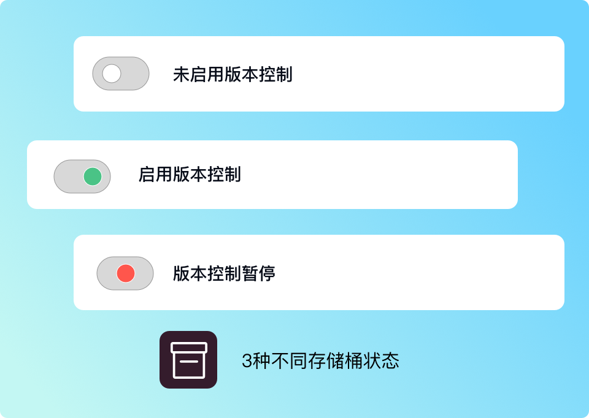

# Versionado de Buckets y Objetos

## El Almacenamiento de Objetos RustFS Proporciona Compatibilidad de Versionado AWS S3

El versionado a nivel de objeto es una mejora significativa comparado con los métodos de versionado SAN y NAS. El versionado no solo proporciona protección de datos sino que también sirve como la base para características poderosas como bloqueo de objetos, inmutabilidad, niveles y gestión del ciclo de vida.

Con RustFS, los objetos son versionados independientemente según la estructura/implementación S3 de Amazon. RustFS asigna un ID único a cada versión de un objeto dado - las aplicaciones pueden especificar un ID de versión en cualquier momento para acceder a una instantánea de punto en el tiempo de ese objeto.

El versionado permite a los usuarios preservar múltiples variantes de un objeto en el mismo bucket y proporciona un mecanismo para guardar, recuperar y restaurar cada versión de cada objeto almacenado en el bucket, eliminando la necesidad de instantáneas. El versionado asegura que los objetos permanezcan disponibles a través de una serie de fallas, incluyendo aquellas causadas por errores de aplicación y humanos.

El versionado se habilita a nivel del bucket. Una vez habilitado, RustFS automáticamente crea un ID de versión único para objetos. El mismo objeto puede tener múltiples versiones.

Uno de los principales beneficios del versionado es prevenir sobreescrituras o eliminaciones accidentales. Esto se implementa usando el concepto de marcadores de eliminación. Cuando un objeto versionado se elimina, no se remueve permanentemente. En su lugar, se crea un marcador de eliminación y se convierte en la versión actual del objeto. Cuando ese objeto se solicita, RustFS devuelve un mensaje 404 Not Found. El objeto puede restaurarse eliminando el marcador de eliminación.

De manera similar, si un objeto versionado se sobreescribe, RustFS crea una nueva versión y se convierte en la versión actual. De la misma manera, las versiones antiguas pueden restaurarse según sea necesario.

## RustFS Soporta Versionado de Objetos con Tres Estados Diferentes de Bucket

Nota que una vez que el versionado está habilitado para un bucket, la operación no puede deshacerse - solo puede suspenderse. El versionado es una configuración global en el bucket - significa que todos los objetos ahora están versionados.

Los usuarios con permisos apropiados pueden suspender el versionado para dejar de acumular versiones de objetos. Similar a habilitar el versionado, esta operación se realiza a nivel del bucket.

Como todas las características de RustFS, el versionado puede aplicarse usando la consola RustFS, cliente (mc), SDK, o a través de aplicaciones de línea de comandos.

El versionado es la forma más simple de proteger datos de operaciones accidentales. Sin embargo, como los objetos son versionados, lleva a tamaños de bucket más grandes y puede resultar en más interdependencias entre objetos y riesgos de dependencias ocultas de objetos. Estos factores pueden mitigarse a través de la gestión del ciclo de vida.

## Ventajas de Características Principales

> Además de sus beneficios de protección de datos, el versionado de almacenamiento de objetos de RustFS sirve como la base para otras características clave

### Características de Funcionalidad Principal

- ✅ **Replicación de Bucket** (Active-Active, Active-Passive)
- ✅ **Mc undo** - Revertir objetos PUT/DELETE con un solo comando
- ✅ **Bloqueo de Objetos**
- ✅ **Protección tipo Protección Continua de Datos** sin la sobrecarga de instantáneas o replicación completa del sistema
- ✅ **Mc rewind** - Ver buckets u objetos en cualquier punto en el tiempo después de que el versionado esté habilitado

## Arquitectura

### Requisitos del Sistema

> El versionado requiere: Codificación de borrado y al menos cuatro discos.

### Estados de Versionado

RustFS soporta tres estados diferentes de versionado de bucket:

1. **🔴 Sin Versión** - Estado predeterminado, no se realiza versionado
2. **🟢 Habilitado** - Funcionalidad completa de versionado, asigna ID único a cada versión de objeto
3. **🟡 Suspendido** - Deja de acumular nuevas versiones pero retiene versiones existentes

### Características Clave

- 🆔 **ID de Versión Único** - Cada versión de objeto tiene un identificador único
- 🔄 **Recuperación de Punto en el Tiempo** - Puede acceder a cualquier versión histórica de un objeto
- 🛡️ **Protección de Eliminación** - Usa marcadores de eliminación para prevenir eliminación accidental
- 📊 **Gestión del Ciclo de Vida** - Gestiona automáticamente el conteo de versiones y costos de almacenamiento
- 🔐 **Control de Permisos** - Gestión de permisos de acceso de granularidad fina

