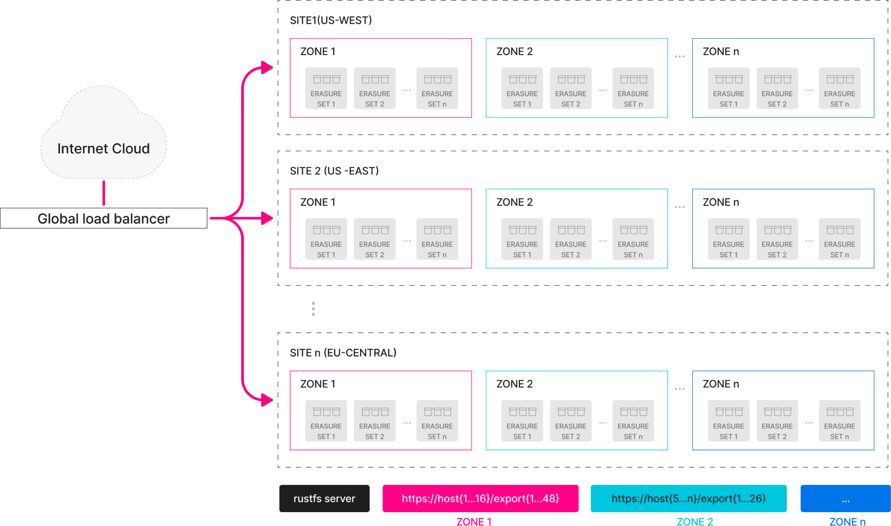

# Versioning des Buckets et Objets

## Le Stockage d'Objets RustFS Fournit une Compatibilité de Versioning AWS S3

Comparé aux approches de versioning SAN et NAS, le versioning au niveau objet est une amélioration significative. Le versioning fournit non seulement une protection des données, mais constitue également la base de fonctionnalités puissantes telles que le verrouillage d'objets, l'immutabilité, la hiérarchisation et la gestion du cycle de vie.

Avec RustFS, les objets sont versionnés indépendamment selon la structure/implémentation S3 d'Amazon. RustFS assigne un ID unique à chaque version d'un objet donné - les applications peuvent spécifier un ID de version à tout moment pour accéder à un instantané temporel de cet objet.

Le versioning permet aux utilisateurs de conserver plusieurs variantes d'un objet dans le même bucket et fournit un mécanisme pour sauvegarder, récupérer et restaurer chaque version de chaque objet stocké dans le bucket, éliminant ainsi le besoin d'instantanés. Le versioning assure que les objets restent disponibles dans une série de pannes, y compris celles causées par des erreurs d'application et humaines.

Le versioning est activé au niveau du bucket. Une fois activé, RustFS crée automatiquement un ID de version unique pour les objets. Le même objet peut avoir plusieurs versions.

Un des principaux avantages du versioning est la prévention des écrasements ou suppressions accidentels. Ceci est exécuté en utilisant le concept de marqueurs de suppression. Lorsqu'un objet versionné est supprimé, il n'est pas supprimé définitivement. Au lieu de cela, un marqueur de suppression est créé et devient la version courante de l'objet. Quand cet objet est demandé, RustFS retourne un message 404 Not Found. L'objet peut être restauré en supprimant le marqueur de suppression.

De même, si un objet versionné est écrasé, RustFS crée une nouvelle version et elle devient la version courante. De la même façon, les anciennes versions peuvent être restaurées selon les besoins.

## RustFS Supporte le Versioning d'Objets avec Trois États de Bucket Différents

Notez qu'une fois le versioning activé pour un bucket, cette opération ne peut pas être annulée - seulement suspendue. Le versioning est un paramètre global dans le bucket - cela signifie que tous les objets sont maintenant versionnés.

Les utilisateurs avec les permissions appropriées peuvent suspendre le versioning pour arrêter l'accumulation des versions d'objets. Similaire à l'activation du versioning, cette opération est exécutée au niveau du bucket.

Comme avec tout RustFS, le versioning peut être appliqué en utilisant la console RustFS, le client (mc), SDK ou via la ligne de commande.

Le versioning est la façon la plus simple de protéger les données contre les opérations accidentelles. Cependant, avec le versioning des objets, il entraîne une taille de bucket plus grande et peut conduire à plus d'interdépendances entre objets ainsi qu'au risque de cacher des dépendances d'objets. Ces facteurs peuvent être atténués par la gestion du cycle de vie.

## Avantages des Fonctionnalités Centrales

> Au-delà de ses avantages de protection des données, le versioning de stockage d'objets de RustFS est également la base d'autres fonctionnalités clés

### Principales Caractéristiques Fonctionnelles

- ✅ **Réplication de buckets** (actif-actif, actif-passif)
- ✅ **Mc undo** - Annuler les opérations PUT/DELETE d'objets avec une seule commande
- ✅ **Verrouillage d'objets**
- ✅ **Protection similaire à la protection continue des données**, sans la surcharge d'instantanés ou de systèmes de réplication complète
- ✅ **Mc rewind** - Voir le bucket ou l'objet à n'importe quel point dans le temps après l'activation du versioning

## Architecture

### Exigences Système

> Le versioning doit exiger : codage d'effacement et au moins quatre disques.

### États de Versioning

RustFS supporte trois états différents de versioning de bucket :

1. **🔴 Non Activé** - État par défaut, pas de versioning
2. **🟢 Activé** - Fonctionnalité de versioning complète, assigne un ID unique à chaque version d'objet
3. **🟡 Suspendu** - Arrête l'accumulation de nouvelles versions, mais préserve les versions existantes

### Caractéristiques Clés

- 🆔 **ID de Version Unique** - Chaque version d'objet a un identifiant unique
- 🔄 **Récupération Point-dans-le-Temps** - Peut accéder à n'importe quelle version historique d'objets
- 🛡️ **Protection contre la Suppression** - Utilise des marqueurs de suppression pour prévenir la suppression accidentelle
- 📊 **Gestion du Cycle de Vie** - Gestion automatique du nombre de versions et des coûts de stockage
- 🔐 **Contrôle des Permissions** - Gestion fine des permissions d'accès