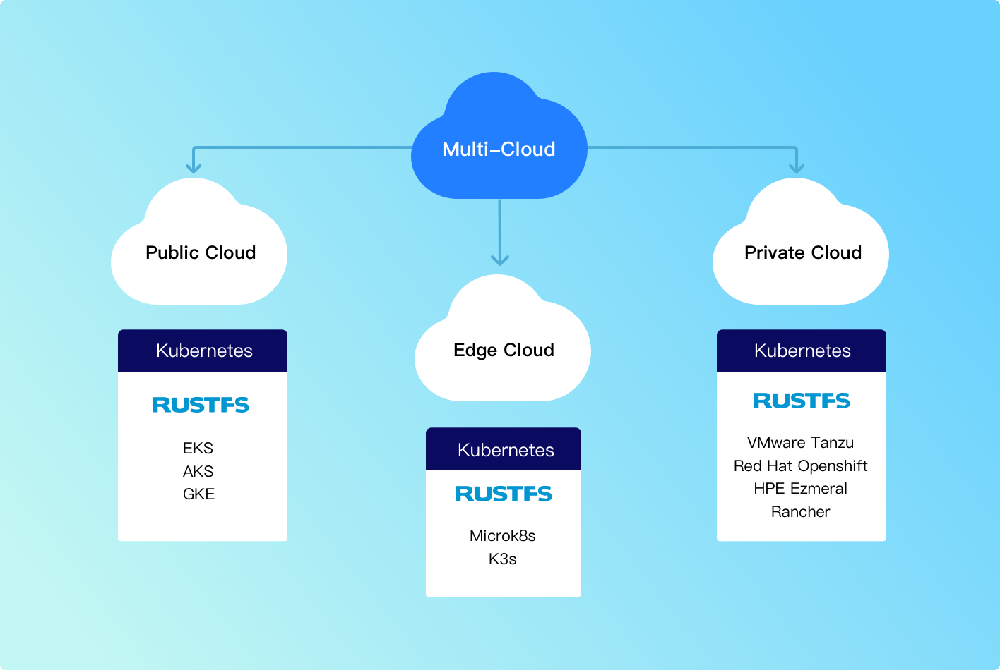

# クラウドネイティブデプロイメント

RustFSは、Kubernetes、コンテナオーケストレーション、モダンなDevOpsワークフローとのシームレスな統合を提供するクラウドネイティブ環境向けに設計されています。

## マルチクラウドアーキテクチャ



RustFSは複数のクラウドプロバイダーにわたるデプロイメントをサポートし、以下を実現します：

- **ベンダー独立性**: クラウドプロバイダーのロックインを回避
- **コスト最適化**: プロバイダー間での最適な価格の活用
- **地理的分散**: 世界中のユーザーにより近い場所にデプロイ
- **リスク軽減**: 単一プロバイダーへの依存を軽減

## Kubernetes統合

### Helmチャートデプロイメント

```bash
# RustFS Helmリポジトリを追加
helm repo add rustfs https://charts.rustfs.com
helm repo update

# RustFSクラスターをインストール
helm install rustfs rustfs/rustfs \
  --set replicas=4 \
  --set storage.size=100Gi \
  --set storage.storageClass=fast-ssd
```

### Operatorデプロイメント

```yaml
apiVersion: rustfs.io/v1
kind: RustFSCluster
metadata:
  name: rustfs-cluster
spec:
  replicas: 4
  storage:
    size: 100Gi
    storageClass: fast-ssd
  resources:
    requests:
      memory: "2Gi"
      cpu: "1"
    limits:
      memory: "4Gi"
      cpu: "2"
```

## コンテナオーケストレーション

### Docker Compose

```yaml
version: '3.8'
services:
  rustfs:
    image: rustfs/rustfs:latest
    ports:
      - "9000:9000"
    volumes:
      - data1:/data1
      - data2:/data2
      - data3:/data3
      - data4:/data4
    command: server /data{1...4} 
    environment:
      - RUSTFS_ROOT_USER=admin
      - RUSTFS_ROOT_PASSWORD=password123
    healthcheck:
      test: ["CMD", "curl", "-f", "http://localhost:9000/rustfs/health/live"]
      interval: 30s
      timeout: 10s
      retries: 3

volumes:
  data1:
  data2:
  data3:
  data4:
```

### Docker Swarm

```yaml
version: '3.8'
services:
  rustfs:
    image: rustfs/rustfs:latest
    ports:
      - "9000:9000"
    volumes:
      - rustfs_data:/data
    deploy:
      replicas: 4
      placement:
        constraints:
          - node.role == worker
      resources:
        limits:
          memory: 4G
        reservations:
          memory: 2G
    command: server http://rustfs_rustfs:9000/data 
    networks:
      - rustfs_network

networks:
  rustfs_network:
    driver: overlay
    attachable: true

volumes:
  rustfs_data:
    driver: local
```

## サービスメッシュ統合

### Istio統合

```yaml
apiVersion: networking.istio.io/v1alpha3
kind: VirtualService
metadata:
  name: rustfs-vs
spec:
  hosts:
  - rustfs.example.com
  gateways:
  - rustfs-gateway
  http:
  - match:
    - uri:
        prefix: /
    route:
    - destination:
        host: rustfs-service
        port:
          number: 9000
      weight: 100
    fault:
      delay:
        percentage:
          value: 0.1
        fixedDelay: 5s
```

### Linkerd統合

```yaml
apiVersion: v1
kind: Service
metadata:
  name: rustfs-service
  annotations:
    linkerd.io/inject: enabled
spec:
  selector:
    app: rustfs
  ports:
  - name: api
    port: 9000
    targetPort: 9000

```

## オブザーバビリティ

### Prometheus監視

```yaml
apiVersion: monitoring.coreos.com/v1
kind: ServiceMonitor
metadata:
  name: rustfs-monitor
spec:
  selector:
    matchLabels:
      app: rustfs
  endpoints:
  - port: metrics
    interval: 30s
    path: /rustfs/v2/metrics/cluster
```

### Grafanaダッシュボード

監視すべき主要メトリクス：

- **クラスターヘルス**: ノードステータス、クォーラムヘルス
- **パフォーマンス**: リクエスト遅延、スループット
- **ストレージ**: 容量使用率、I/Oメトリクス
- **ネットワーク**: 帯域幅、接続数

### 分散トレーシング

```yaml
# Jaeger統合
apiVersion: v1
kind: ConfigMap
metadata:
  name: rustfs-tracing
data:
  tracing.yaml: |
    jaeger:
      endpoint: http://jaeger-collector:14268/api/traces
      service_name: rustfs
      sample_rate: 0.1
```

## CI/CD統合

### ArgoCDを使用したGitOps

```yaml
apiVersion: argoproj.io/v1alpha1
kind: Application
metadata:
  name: rustfs-app
spec:
  project: default
  source:
    repoURL: https://github.com/company/rustfs-config
    targetRevision: HEAD
    path: kubernetes
  destination:
    server: https://kubernetes.default.svc
    namespace: rustfs
  syncPolicy:
    automated:
      prune: true
      selfHeal: true
```

### Jenkinsパイプライン

```groovy
pipeline {
    agent any
    stages {
        stage('Build') {
            steps {
                sh 'docker build -t rustfs:${BUILD_NUMBER} .'
            }
        }
        stage('Test') {
            steps {
                sh 'docker run --rm rustfs:${BUILD_NUMBER} test'
            }
        }
        stage('Deploy') {
            steps {
                sh '''
                    helm upgrade --install rustfs ./helm-chart \
                        --set image.tag=${BUILD_NUMBER} \
                        --namespace rustfs
                '''
            }
        }
    }
}
```

## セキュリティ

### Podセキュリティ標準

```yaml
apiVersion: v1
kind: Pod
metadata:
  name: rustfs-pod
spec:
  securityContext:
    runAsNonRoot: true
    runAsUser: 1000
    fsGroup: 1000
  containers:
  - name: rustfs
    image: rustfs/rustfs:latest
    securityContext:
      allowPrivilegeEscalation: false
      capabilities:
        drop:
        - ALL
      readOnlyRootFilesystem: true
```

### ネットワークポリシー

```yaml
apiVersion: networking.k8s.io/v1
kind: NetworkPolicy
metadata:
  name: rustfs-network-policy
spec:
  podSelector:
    matchLabels:
      app: rustfs
  policyTypes:
  - Ingress
  - Egress
  ingress:
  - from:
    - podSelector:
        matchLabels:
          app: client
    ports:
    - protocol: TCP
      port: 9000
```

## ベストプラクティス

### リソース管理

1. **リソース制限**
   - 適切なCPUとメモリ制限を設定
   - 名前空間レベルでリソースクォータを使用
   - リソース使用率の傾向を監視

2. **ストレージクラス**
   - 高性能ワークロードには高速SSDを使用
   - 耐久性のためにリージョナル永続ディスクを検討
   - 自動バックアップ戦略を実装

### 高可用性

1. **マルチゾーンデプロイメント**

   ```yaml
   spec:
     affinity:
       podAntiAffinity:
         requiredDuringSchedulingIgnoredDuringExecution:
         - labelSelector:
             matchExpressions:
             - key: app
               operator: In
               values:
               - rustfs
           topologyKey: topology.kubernetes.io/zone
   ```

2. **ヘルスチェック**

   ```yaml
   livenessProbe:
     httpGet:
       path: /rustfs/health/live
       port: 9000
     initialDelaySeconds: 30
     periodSeconds: 10

   readinessProbe:
     httpGet:
       path: /rustfs/health/ready
       port: 9000
     initialDelaySeconds: 10
     periodSeconds: 5
   ```

## トラブルシューティング

### 一般的な問題

1. **Pod起動問題**
   - リソース制約を確認
   - ストレージクラスの可用性を検証
   - セキュリティコンテキストをレビュー

2. **ネットワーク接続**
   - サービス検出を検証
   - ネットワークポリシーを確認
   - DNS解決を監視

3. **パフォーマンス問題**
   - リソース使用率を分析
   - ストレージI/Oパターンを確認
   - ネットワーク帯域幅をレビュー

