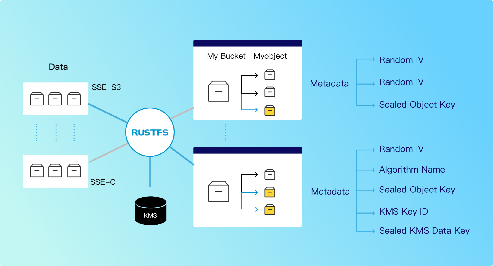

# 大規模データのためのインフラストラクチャ

RustFSはスケール用に設計されています。技術的スケール、運用スケール、そして経済的スケール。基盤となるスケール。

オブジェクトストレージの分野では、交渉テーブルで席を得るためには堅牢な暗号化が必要です。RustFSは最高レベルの暗号化と広範な最適化を通じてより多くの機能を提供し、通常ストレージ暗号化操作に関連するオーバーヘッドを事実上排除しています。

RustFSはディスクに保存される時とネットワーク経由で送信される時の両方でデータを暗号化します。RustFSの最先端暗号化スキームは、AES-256-GCM、ChaCha20-Poly1305、AES-CBCなどの現代的な業界標準暗号化アルゴリズムを使用して、きめ細かいオブジェクトレベルの暗号化をサポートしています。RustFSはS3暗号化セマンティクスと完全に互換性があり、Hashicorp Vault、Gemalto KeySecure、Google Secrets Managerなどの非AWSキー管理サービスをサポートすることでS3を拡張しています。

## ネットワーク暗号化

オブジェクトストレージとアプリケーション間でデータが送信される際、未知および/または信頼できない任意の数のネットワーク間を跳ね回る可能性があります。ネットワーク経由での送信中にデータを暗号化すること（「転送中」とも呼ばれる）は、中間者攻撃を効果的に軽減し、選択されたルーティングパスに関係なくデータの安全性を確保します。

RustFSはクラスター内のすべてのコンポーネント間でTransport Layer Security (TLS) v1.2+をサポートしています。このアプローチにより、クラスター間またはクラスター内の暗号化されたトラフィックに弱いリンクがないことを保証します。TLSは遍在的な暗号化フレームワークです：銀行、eコマースウェブサイト、およびデータストレージ暗号化に依存する他のエンタープライズレベルのシステムで使用されているのと同じ暗号化プロトコルです。

RustFSのTLS実装は、無視できる性能オーバーヘッドでCPU命令レベルで最適化されています。クラスター内の各RustFSサーバーにTLSプライベートキーとパブリック証明書を指定するだけで済みます。Kubernetes環境では、RustFS Kubernetes Operatorがテナントデプロイメント中にTLS証明書を統合/自動生成および割り当てします。RustFSは複数のTLS証明書をサポートし、各証明書は特定のドメイン名に対応します。RustFSはServer Name Indication (SNI)を使用して、任意のリクエストに対してどの証明書を提供するかを決定します。

## オブジェクト暗号化

ディスクに保存されたデータは、データセキュリティを確保するためにディスクのセキュリティに完全に依存し、ホストシステムにまで及びます。RustFSサーバーサイドオブジェクト暗号化は、データがディスクに保存される前に自動的に暗号化します（保存時暗号化）。このアプローチにより、暗号化されていないディスクにデータが書き込まれないことが保証されます。このベースラインセキュリティレイヤーは、保存時データの機密性、整合性、真正性を確保します。RustFSは、データ暗号化における最大の柔軟性のために、クライアント駆動型と自動バケットデフォルトオブジェクト暗号化の両方をサポートしています。

RustFSサーバーサイド暗号化はAmazon AWS-S3セマンティクス（SSE-S3）と互換性があります。RustFSはAWS KMSの基本サポートを拡張して、Hashicorp VaultやThales Ciphertrust（旧Gemalto KeySecure）などの一般的なエンタープライズKMSシステムを含めています。RustFSはクライアント駆動型暗号化（SSE-C）もサポートしており、アプリケーションがオブジェクトの暗号化に使用するデータキーを指定できます。SSE-S3とSSE-Cの両方で、RustFSサーバーはキーローテーションとオブジェクト再暗号化を含むすべての暗号化操作を実行します。

自動サーバーサイド暗号化を通じて、RustFSは各オブジェクトを一意のキーで暗号化し、動的暗号化キーと外部KMSまたはクライアント提供キーから派生したキーを使用して複数の追加暗号化レイヤーを適用します。この安全で洗練されたアプローチは、複数の独立したカーネルおよびユーザースペース暗号化ユーティリティを処理する必要なく、RustFS内で実行されます。

RustFSはAuthenticated Encryption with Associated Data (AEAD)スキームを使用して、オブジェクトがオブジェクトストレージに書き込まれるか読み取られる際にオブジェクトを暗号化/復号化します。RustFS AEAD暗号化は、オブジェクトデータを保護するためにAES-256-GCMやChaCha20-Poly1305などの業界標準暗号化プロトコルをサポートしています。RustFSのCPUレベル最適化（SIMD加速など）により、暗号化/復号化操作の性能オーバーヘッドは無視できます。組織は、次善のセキュリティ選択を強制されるのではなく、いつでも自動バケットレベル暗号化を実行できます。

## RustFS Key Encryption Service

RustFSはキー暗号化のための組み込みオプションを提供します。RustFSのKey Encryption Service（KES）は、高性能アプリケーション用のステートレス分散キー管理システムです。Kubernetesで実行し、暗号化キーをアプリケーションに配布するよう設計されています。KESはRustFSサーバーサイドオブジェクト暗号化（SSE-S3）に必要なコンポーネントです。

KESはRustFSクラスターでの暗号化操作をサポートし、スケーラブルで高性能な暗号化操作を確保するためのキーメカニズムです。KESはRustFSクラスターと外部KMS間の仲介者として機能し、必要に応じて暗号化キーを生成し、KMS制約に制限されることなく暗号化操作を実行します。したがって、マスターキーを保護し、インフラストラクチャの信頼のルートとして機能する中央KMSがまだあります。KESは、各アプリケーションセットのKMSをブートストラップする必要性を排除することで、デプロイメントと管理を簡素化します。代わりに、アプリケーションはKESサーバーからデータ暗号化キー（DEK）を要求したり、KESサーバーに暗号化されたDEKを復号化させることができます。

KESサーバーは完全にステートレスなので、Kubernetes Horizontal Pod Autoscalerなどによって自動的にスケールできます。同時に、KESが大多数のアプリケーションリクエストを独立して処理するため、中央KMSの負荷は大幅に増加しません。

Kubernetes環境では、RustFS Kubernetes Operatorが各テナントのKESのデプロイメントと設定をサポートし、各テナントデプロイメントの一部としてSSE-S3を有効にします。

## サポートされる外部キー管理システム

|  |  |  |
|-------------------------------|----------------------------------------|-------------------------------------------|
|  |  |  |

