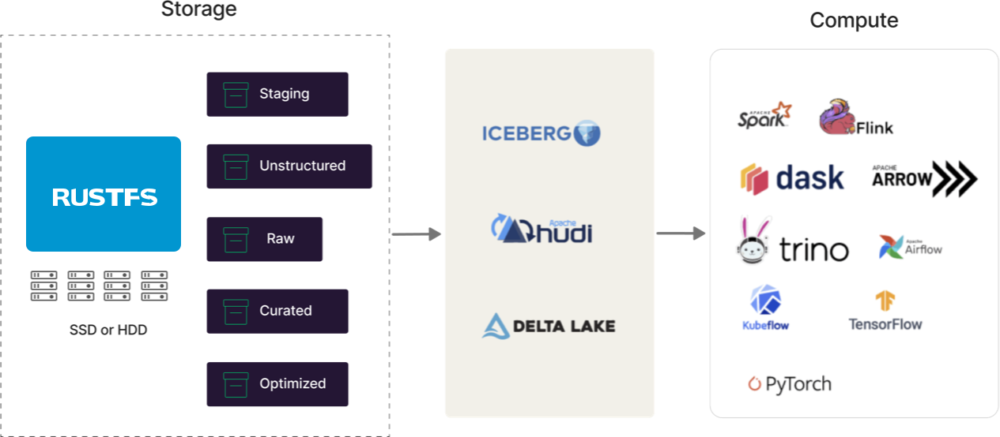

# 面向现代数据湖的 RustFS

现代数据湖和数据湖仓一体建立在现代对象存储之上。这意味着它们建立在 RustFS 之上。

**RustFS 为现代数据湖/湖仓一体提供统一的存储解决方案，这些可以在任何地方运行：私有云、公共云、Colos、裸机 - 甚至在边缘。是的，快速、可扩展、云原生且随时可用 - 包括所有电池。**

## 打开表格格式就绪

现代数据湖是多引擎的，这些引擎（Spark、Flink、Trino、Arrow、Dask 等）都需要以某种方式绑定成一个有凝聚力的建筑。现代数据湖必须提供中央表存储，便携式通勤、门禁控制和持久结构。这就是 Iceberg、Hudi 和 Delta Lake 等格式开始发挥作用。它们是为现代数据湖设计的，它们是 RustFS 支持每个。我们可能会对哪一方获胜有意见（你可以随时问我们...但我们致力于支持他们，直到它没有意义（参见 Docker Swarm 和 Mesosphere）。

## 云原生

RustFS 诞生于云中，并坚持云的原则运营模型 - 容器化、编排、微服务、API、基础架构即代码和自动化。正因为如此，云原生生态系统与 RustFS "一起工作"——从 Spark 到 Presto/Trino，从 Snowflake 到 Dremio，从 Nifi 到 Kafka，从 Prometheus 到 OpenObserve，从 Istio 到 Linkerd，从 Hashicorp Vault 到 Keycloak。

不要相信我们的话 - 输入您最喜欢的云原生技术并让谷歌为你提供证据。

## 多引擎

RustFS 支持所有兼容 S3 的查询引擎，也就是说所有他们。没有看到您使用的 - 给我们留言，我们将进行调查。

## 性能

现代数据湖需要一定程度的性能，甚至更多重要的是，大规模的性能，这是 Hadoop 梦寐以求的老式物品商店只是幻想。RustFS 已在多个基准测试表明它比 Hadoop 和迁移路径已明确记录。这意味着查询引擎（Spark、Presto、Trino，Snowflake，Microsoft SQL Server，Teradata 等）。这也包括您的 AI/ML 平台 - 从 MLflow 到 Kubeflow。

我们发布我们的基准供全世界查看，并使其可重复。了解我们如何在 GET 上达到 325 GiB/s（349 GB/s）和 165 GiB/s（177 GB/s）在这篇文章中，只有 32 个现成的 NVMe SSD 节点的 PUT。

## 轻

RustFS 的服务器二进制文件全部为 < 100 MB。尽管它很大，但它是强大到足以在数据中心运行，但仍然足够小，可以生存舒适地在边缘。在 Hadoop 中没有这样的替代方案世界。这对企业来说意味着您的 S3 应用程序可以随时随地使用相同的 API 访问数据。实施 RustFS 边缘位置和复制功能，我们可以捕获和过滤数据在边缘，并将其传送到母集群进行聚合，以及进一步的分析实施。

## 分解

现代数据湖扩展了 Hadoop 中的分解功能分手。现代数据湖具有高速查询处理引擎和它们具有高吞吐量存储。现代数据湖太大了以适合数据库，因此数据驻留在对象存储中。这方式，数据库可以专注于查询优化功能和将存储功能外包给高速对象存储。通过保持内存中数据的子集，并利用诸如谓词下推（S3 Select）和外部表 - 查询引擎具有更大的灵活性。

## 开源

采用 Hadoop 的企业这样做是出于对开放源技术的偏好。作为合乎逻辑的继任者 - 企业希望他们的 DataLake 也将开源。这就是冰山蓬勃发展的原因以及 Databricks 开源 Deltalake 的原因。

检查能力、无锁定和舒适性来自数以万计的用户，具有实实在在的价值。RustFS 也是 100% 开源，确保组织能够忠于他们的在投资现代数据湖时实现目标。

## 迅猛增长

数据是不断生成的，这意味着它必须不断地生成被摄入 - 不会引起消化不良。RustFS 就是为此而生的世界，开箱即用，可与 Kafka、Flink、RabbitMQ 和大量其他解决方案。结果是 datalake/datalakehouse 成为单一事实来源，可以无缝扩展到 EB 及其他领域。

RustFS 有多个客户端，其每日数据摄取量超过 250PB。

## 简单

简单是很难的。这需要工作、纪律，最重要的是，承诺。RustFS 的简单性是传奇的，是哲学承诺使我们的软件易于部署、使用、升级和扩展。现代数据湖不必很复杂。有一个少数部分，我们致力于确保 RustFS 是最容易采用和部署。

## ELT 或 ETL - 它只是工作

RustFS 不仅适用于每个数据流协议，而且每个数据管道，都是每个数据流协议和数据管道与 RustFS 配合使用。每个供应商都进行了广泛的测试，并且通常，数据管道具有弹性和性能。

## 弹性

RustFS 使用每个对象的内联纠删码来保护数据，这远远比复制后的 HDFS 替代方案更有效，并且从未被采用。此外，RustFS 的 bitrot 检测确保它永远不会读取损坏的数据 - 捕获和修复损坏的数据动态对象。RustFS 还支持跨地域、主动-主动复制。最后，RustFS 支持完整的对象锁定框架提供法律保留和保留（具有治理和合规性）模式）。

## 软件定义

Hadoop HDFS 的继任者不是硬件设备，而是软件在商用硬件上运行。这就是 RustFS 的本质——软件。喜欢 Hadoop HDFS，RustFS 旨在充分利用商品的优势服务器。能够利用 NVMe 驱动器和 100 GbE 网络，RustFS 可以缩小数据中心，从而改善运营效率和可管理性。事实上，建立替代品的公司数据湖将其硬件占用空间减少 60% 或更多，同时改进性能并减少管理它所需的 FTE。

## 安全

RustFS 支持多种复杂的服务器端加密方案，以保护数据，无论数据位于何处，无论是在飞行中还是在静止状态。RustFS 的方法确保机密性、完整性和真实性性能开销可以忽略不计。服务器端和客户端加密支持使用 AES-256-GCM、ChaCha20-Poly1305 和 AES-CBC，确保应用程序兼容性。此外，RustFS 支持行业领先的密钥管理系统（KMS）。
