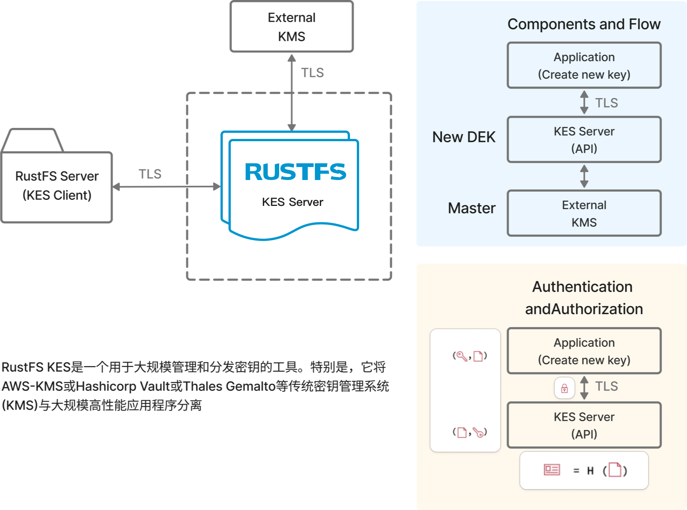

# Infraestrutura para Dados em Larga Escala

O RustFS foi projetado para escala. Escala técnica, operacional e econômica. Escala fundamental.

No campo de armazenamento de objetos, criptografia robusta é necessária para ter um lugar à mesa de negociação. O RustFS fornece mais funcionalidade através do mais alto nível de criptografia e otimizações extensivas, virtualmente eliminando a sobrecarga tipicamente associada às operações de criptografia de armazenamento.

O RustFS criptografa dados tanto quando armazenados em disco quanto quando transmitidos pela rede. O esquema de criptografia de última geração do RustFS suporta criptografia de nível de objeto de granularidade fina usando algoritmos de criptografia padrão da indústria moderna como AES-256-GCM, ChaCha20-Poly1305 e AES-CBC. O RustFS é totalmente compatível com a semântica de criptografia S3 e também estende o S3 ao suportar serviços de gerenciamento de chaves não-AWS como Hashicorp Vault, Gemalto KeySecure e Google Secrets Manager.

## Criptografia de Rede

Quando dados são transmitidos entre armazenamento de objetos e aplicações, podem passar por qualquer número de redes desconhecidas e/ou não confiáveis. Criptografar dados enquanto são transmitidos pela rede (também conhecido como "em trânsito") mitiga com sucesso ataques man-in-the-middle e garante que os dados permaneçam seguros independentemente do caminho de roteamento tomado.

O RustFS suporta Transport Layer Security (TLS) v1.2+ entre todos os componentes do cluster. Essa abordagem garante que não haja elos fracos no tráfego criptografado entre ou dentro dos clusters. TLS é um framework de criptografia ubíquo: é o mesmo protocolo de criptografia usado por bancos, sites de e-commerce e outros sistemas de nível empresarial que dependem de criptografia de armazenamento de dados.

A implementação TLS do RustFS é otimizada ao nível de instrução de CPU com sobrecarga de performance negligível. Requer apenas especificar chaves privadas TLS e certificados públicos para cada servidor RustFS no cluster. Para ambientes Kubernetes, o RustFS Kubernetes Operator integra/gera automaticamente e atribui certificados TLS durante a implantação do tenant. O RustFS suporta múltiplos certificados TLS, onde cada certificado corresponde a um nome de domínio específico. O RustFS usa Server Name Indication (SNI) para determinar qual certificado servir para qualquer solicitação dada.

## Criptografia de Objetos

Dados armazenados em disco dependem inteiramente da segurança do disco e se estendem ao sistema host para garantir a segurança dos dados. A criptografia de objetos do lado do servidor RustFS criptografa automaticamente os dados antes de serem armazenados em disco (criptografia em repouso). Essa abordagem garante que nenhum dado seja escrito em discos não criptografados. Esta camada de segurança básica garante a confidencialidade, integridade e autenticidade dos dados em repouso. O RustFS suporta tanto criptografia de objetos dirigida pelo cliente quanto padrão automática de bucket para máxima flexibilidade na criptografia de dados.

A criptografia do lado do servidor RustFS é compatível com a semântica Amazon AWS-S3 (SSE-S3). O RustFS estende o suporte básico para AWS KMS para incluir sistemas KMS empresariais comuns como Hashicorp Vault e Thales Ciphertrust (anteriormente Gemalto KeySecure). O RustFS também suporta criptografia dirigida pelo cliente (SSE-C), onde aplicações podem especificar a chave de dados usada para criptografar objetos. Para ambos SSE-S3 e SSE-C, o servidor RustFS executa todas as operações de criptografia, incluindo rotação de chaves e re-criptografia de objetos.

Através da criptografia automática do lado do servidor, o RustFS criptografa cada objeto com uma chave única e aplica múltiplas camadas de criptografia adicional usando chaves de criptografia dinâmicas e chaves derivadas de KMS externo ou chaves fornecidas pelo cliente. Essa abordagem segura e sofisticada é executada dentro do RustFS sem a necessidade de lidar com múltiplos utilitários de criptografia de kernel e userspace independentes.

O RustFS usa esquemas de Authenticated Encryption with Associated Data (AEAD) para criptografar/descriptografar objetos quando objetos são escritos ou lidos do armazenamento de objetos. A criptografia AEAD do RustFS suporta protocolos de criptografia padrão da indústria como AES-256-GCM e ChaCha20-Poly1305 para proteger dados de objetos. As otimizações de nível de CPU do RustFS (como aceleração SIMD) garantem sobrecarga de performance negligível para operações de criptografia/descriptografia. Organizações podem executar criptografia automática de nível de bucket a qualquer momento ao invés de serem forçadas a fazer escolhas de segurança subótimas.

## Serviço de Criptografia de Chaves RustFS

O RustFS fornece opções integradas para criptografia de chaves. O Key Encryption Service (KES) do RustFS é um sistema de gerenciamento de chaves distribuído sem estado para aplicações de alta performance. É projetado para executar em Kubernetes e distribuir chaves de criptografia para aplicações. KES é um componente necessário para criptografia de objetos do lado do servidor RustFS (SSE-S3).

O KES suporta operações de criptografia em clusters RustFS e é um mecanismo chave para garantir operações de criptografia escaláveis e de alta performance. O KES atua como um intermediário entre clusters RustFS e KMS externo, gerando chaves de criptografia conforme necessário e executando operações de criptografia sem ser limitado por restrições do KMS. Portanto, ainda há um KMS central que protege chaves mestras e serve como raiz de confiança na infraestrutura. O KES simplifica a implantação e gerenciamento eliminando a necessidade de inicializar KMS para cada conjunto de aplicações. Em vez disso, aplicações podem solicitar chaves de criptografia de dados (DEKs) dos servidores KES ou pedir aos servidores KES para descriptografar DEKs criptografadas.

Como os servidores KES são completamente sem estado, podem ser escalados automaticamente, como através do Kubernetes Horizontal Pod Autoscaler. Ao mesmo tempo, como o KES lida independentemente com a vasta maioria das solicitações de aplicações, a carga no KMS central não aumenta significativamente.

Para ambientes Kubernetes, o RustFS Kubernetes Operator suporta implantação e configuração do KES para cada tenant, habilitando SSE-S3 como parte de cada implantação de tenant.

## Sistemas de Gerenciamento de Chaves Externos Suportados

|  |  |  |
|-------------------------------|----------------------------------------|-------------------------------------------|
|  |  |  |
