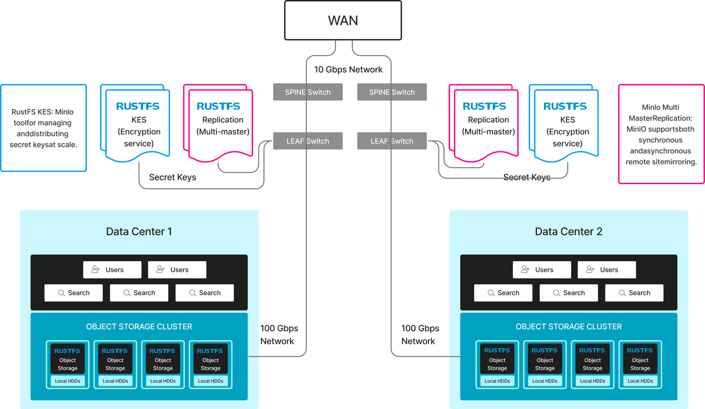

# Replicação multi‑site ativo‑ativo para object storage

## Replicação ativa para object storage

Replicação ativa é requisito crítico em produção. O RustFS oferece essa capacidade com granularidade por bucket:

O RustFS suporta replicação síncrona e quase síncrona, conforme arquitetura e taxa de alterações. Em todos os casos, busca consistência tão estrita quanto possível (respeitando banda/latência).

## Replicação no RustFS para resiliência em grande escala

Inclui:

- ✅ Objetos (encriptados ou não) e metadados associados (gravados atomicamente)
- ✅ Versionamento
- ✅ Labels de objetos (se houver)
- ✅ Informação de retenção/lock S3 (se houver)

## Capacidades‑chave

### Fonte e destino com mesmo nome de bucket

Necessário para failover transparente sem interrupção.

### Lock/retention copiados automaticamente entre origem/destino

Mantém integridade/conformidade durante replicação.

### Quase síncrona

Atualiza imediatamente após mutações no bucket. Consistência estrita intra‑DC e eventual entre DCs.

### Notificações

Eventos de falha de replicação para subscrição por apps/equipa de operações.

## Considerações para ativo‑ativo

Projetos devem considerar infraestrutura, banda, latência, resiliência e escala:

### Base

Hardware idêntico em ambos os lados é recomendado. Heterogeneidade aumenta complexidade e dificulta troubleshooting.

### Banda

A banda ideal depende da taxa de entrada de dados. Se insuficiente nos picos, mudanças serão enfileiradas e sincronizadas depois.

### Latência

Após banda, latência (RTT) é crucial. Objetivo: minimizar RTT dentro do orçamento de banda. Recomendação: RTT ≤ 20 ms e perda ≤ 0,01%.

### Arquitetura

Atualmente recomenda‑se replicação entre dois DCs. Mais DCs é possível, mas complexidade/compromissos crescem.

## Deploy em grande escala

Suporta grandes implantações por DC (origem/destino). Escala depende das considerações acima.

## FAQ

### O que acontece se o destino falhar?

A origem armazena alterações e sincroniza ao voltar. O tempo até full sync depende da duração da falha, nº de mudanças, banda e latência.

### Como fica a imutabilidade?

É suportada. Em ativo‑ativo, só é garantida se o objeto for versionado. Não é possível desativar versionamento na origem. Pausar versionamento no destino leva a falhas de replicação.

### E se versionamento for pausado ou divergir?

Replicação pode falhar. Para desativar versionamento na origem, primeiro remova a configuração de replicação. Versionamento desativado no destino quebrará a replicação.

### E se object lock não estiver ativo em ambos?

Object lock deve estar ativo em origem e destino. Casos extremos (recriar bucket destino sem lock) podem causar falhas silenciosas ou inconsistências.
