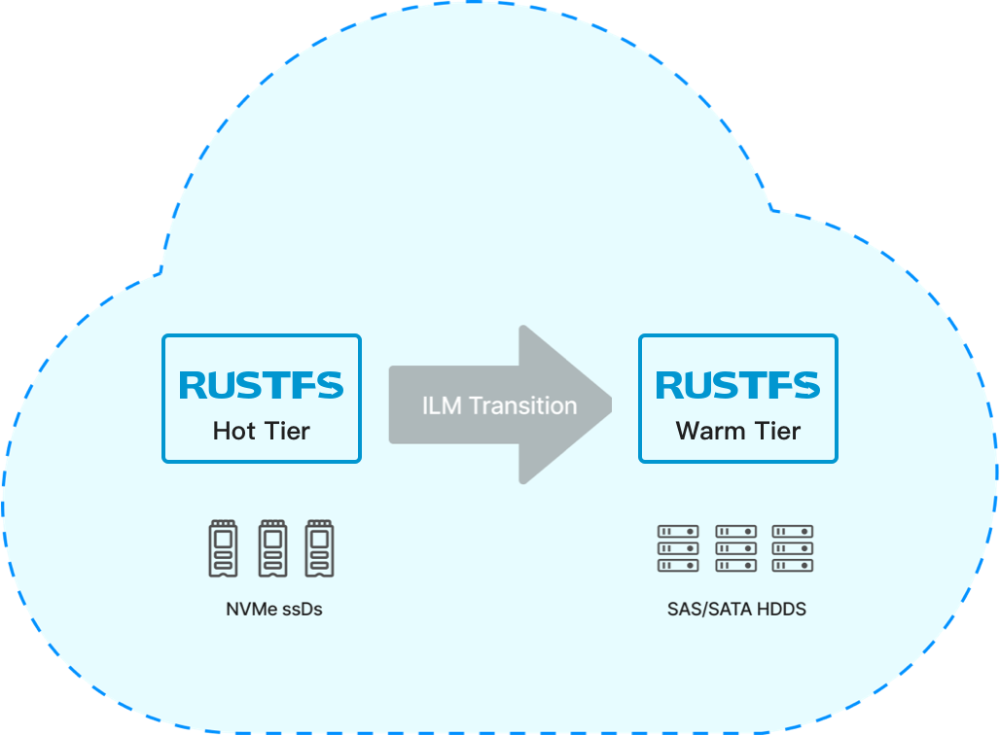

# Управление жизненным циклом данных и многоуровневое хранение

По мере продолжения роста данных способность совместной оптимизации для доступа, безопасности и экономики становится жестким требованием, а не просто приятным дополнением. Именно здесь вступает в игру управление жизненным циклом данных. RustFS предоставляет уникальный набор функций для защиты данных внутри и между облаками - включая публичные и частные облака. Инструменты корпоративного управления жизненным циклом данных RustFS, включая версионирование, блокировку объектов и различные производные компоненты, удовлетворяют многим случаям использования.

## Истечение срока действия объектов

Данные не должны существовать вечно: инструменты управления жизненным циклом RustFS позволяют определить, как долго данные остаются на диске перед удалением. Пользователи определяют продолжительность времени как конкретную дату или количество дней, прежде чем RustFS начнет удалять объекты.

Правила управления жизненным циклом создаются для каждой корзины и могут быть построены с использованием любой комбинации фильтров объектов и тегов. Не указывайте фильтры для установки правил истечения срока действия для всей корзины или укажите несколько правил для создания более сложного поведения истечения срока действия.

Правила истечения срока действия объектов RustFS также применяются к версионированным корзинам и поставляются с некоторыми специфическими для версионирования вариантами. Например, вы можете указать правила истечения срока действия только для неактуальных версий объектов, чтобы максимизировать преимущества версионирования объектов без возникновения долгосрочных затрат на хранение. Аналогично, вы можете создать правила управления жизненным циклом для удаления объектов, единственной оставшейся версией которых является маркер удаления.

Правила истечения срока действия корзины полностью соответствуют блокировке WORM RustFS и правовым удержаниям - объекты в заблокированном состоянии останутся на диске до истечения срока действия блокировки или ее явного освобождения. Как только объекты больше не ограничены блокировками, RustFS начинает нормально применять правила истечения срока действия.

Правила управления жизненным циклом истечения срока действия объектов RustFS функционально и синтаксически совместимы с управлением жизненным циклом AWS. RustFS также поддерживает импорт существующих правил в формате JSON, что упрощает миграцию существующих правил истечения срока действия AWS.

## Многоуровневое хранение объектов на основе политик

RustFS может быть программно настроен для многоуровневого хранения объектов так, чтобы объекты переходили из одного состояния или класса в другой на основе любого количества переменных - хотя наиболее часто используемыми являются время и частота доступа. Эта функция лучше всего понимается в контексте многоуровневого хранения. Многоуровневое хранение позволяет пользователям оптимизировать затраты на хранение или функциональность в ответ на изменение паттернов доступа к данным. Многоуровневое хранение данных обычно используется в следующих сценариях:

## Между носителями хранения

Многоуровневое хранение между носителями хранения является наиболее известным и простым случаем использования многоуровневого хранения. Здесь RustFS абстрагирует базовые носители и совместно оптимизирует производительность и стоимость. Например, для производительности или рабочих нагрузок nearline данные могут храниться на NVMe или SSD, но через некоторое время перемещаться на носители HDD или для рабочих нагрузок, которые ценят масштабирование производительности. Со временем, если это уместно, эти данные могут быть дополнительно перенесены в долгосрочное хранилище.

## Между типами облаков

Быстро развивающийся случай использования включает использование дешевых ресурсов хранения и вычислений публичного облака как еще одного уровня для частных облаков. В этом случае использования ориентированные на производительность рабочие нагрузки nearline выполняются с использованием соответствующих носителей частного облака. Объем данных не имеет значения, но важны ценность и ожидания производительности. По мере увеличения объемов данных и снижения ожиданий производительности предприятия могут использовать варианты холодного хранения публичного облака для оптимизации затрат и возможностей доступа, связанных с сохранением данных.

Это достигается путем запуска RustFS как в частных, так и в публичных облаках. Используя репликацию, RustFS может перемещать данные в дешевые варианты публичного облака и использовать RustFS в публичном облаке для их защиты и доступа при необходимости. В этом случае публичное облако становится немым хранилищем для RustFS, точно так же, как JBOD становится немым хранилищем для RustFS. Этот подход избегает замены и добавления устаревшей ленточной инфраструктуры.

## В публичных облаках

RustFS обычно служит основным уровнем хранения приложений в публичных облаках. В этом случае, как и в других случаях использования, RustFS является единственным хранилищем, к которому обращаются приложения. Приложения (и разработчики) не должны знать ничего, кроме конечной точки хранения. RustFS определяет, какие данные куда принадлежат, на основе параметров управления. Например, RustFS может определить, что блочные данные должны перейти на объектный уровень, и какой объектный уровень соответствует целям производительности и экономики предприятия.

RustFS объединяет различные уровни многоуровневого хранения и определяет подходящие носители для обеспечения лучшей экономики без ущерба для производительности. Приложения просто обращаются к объектам через RustFS, в то время как RustFS прозрачно применяет политики для перемещения объектов между уровнями и сохраняет метаданные этого объекта на блочном уровне.

