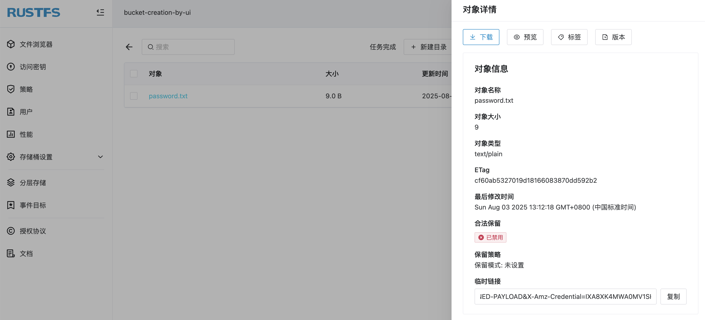

# RustFS Nesne

Nesne (Object), RustFS depolamanın temel birimidir ve veri, metadata ve benzersiz tanımlayıcı (Object Key) içerir. Veriler nesne biçiminde depolanır. Bu bölüm dosya yükleme ve silme örneğiyle nesne yönetimini tanıtır.

> Nesne (Object) ile ilgili kavramlar için [Temel Kavramlar](../../concepts/glossary.md) bölümüne bakabilirsiniz.

## Nesne Oluşturma

Ön koşullar:

- Kullanılabilir bir RustFS örneği. Kurulum için [Kurulum Kılavuzu](../../installation/index.md)'na başvurabilirsiniz.

[Bir bucket oluşturun](../bucket/creation.md), ardından bucket'a dosya yükleyin, bu nesne oluşturma işlemini tamamlayacaktır. RustFS UI, `mc` ve API yöntemiyle dosya yükleyebilirsiniz.

### RustFS UI'da Dosya Yükleme

1. RustFS UI konsoluna giriş yapın.
1. Dosya yüklemek istediğiniz bucket'ı seçin.
1. Bucket sayfasında, sağ üst köşede **Yeni Dizin**, **Yeni Dosya** veya **Dosya/Klasör Yükle**'yi seçerek dosya/klasör oluşturmayı tamamlayın.
1. Yerel dosya/klasör yüklemek için **Dosya/Klasör Yükle** düğmesine tıklayın, yerel dosya/klasörü seçin, dosya yüklemeyi tamamlamak için **Yüklemeyi Başlat**'a tıklayın.


Yükleme tamamlandıktan sonra, nesnenin detay bilgilerini görmek için o nesneye tıklayın.



### `mc` Kullanarak Dosya Yükleme

> `mc` kurulumu ve yapılandırması için [`mc` Kullanım Kılavuzu](../../developer/mc.md) bölümüne bakabilirsiniz.

Dosya yüklemek için `mc cp` komutunu kullanın:

```
# dosya yükle
mc cp 1.txt rustfs/bucket-creation-by-mc
/tmp/1.txt:            13 B / 13 B  ▓▓▓▓▓▓▓▓▓▓▓▓▓▓▓▓▓▓▓▓▓▓▓▓▓▓▓▓▓▓▓▓▓▓▓▓▓▓▓  61 B/s 0s%

# dosya yüklemeyi onayla
mc ls rustfs/bucket-creation-by-mc
[2025-08-01 10:01:08 CST]    13B 1.txt
```

Yükleme tamamlandıktan sonra, RustFS konsolunda görüntüleyebilirsiniz.

### API Kullanarak Dosya Yükleme

Dosya yüklemek için aşağıdaki API'yi kullanın:

```
PUT /{bucketName}/{objectName} HTTP/1.1
```

İstek örneği:

```
curl --location --request PUT 'http://12.34.56.78:9000/bucket-creation-by-api/password.txt' \
--header 'Content-Type: text/plain' \
--header 'X-Amz-Content-Sha256: e3b0c44298fc1c149afbf4c8996fb92427ae41e4649b934ca495991b7852b855' \
--header 'X-Amz-Date: 20250801T024840Z' \
--header 'Authorization: AWS4-HMAC-SHA256 Credential=H4xcBZKQfvJjEnk3zp1N/20250801/cn-east-1/s3/aws4_request, SignedHeaders=content-length;content-type;host;x-amz-content-sha256;x-amz-date, Signature=b7d8dc29ee34dfdf1f3e9e8e069892a8936f478586e7a2c90cf34f5b86d3a2dc' \
--data-binary '@/path/to/password.txt'
```

Yükleme tamamlandıktan sonra, RustFS konsolunda görüntüleyebilirsiniz.

## Nesne Silme

Aynı şekilde UI'da, `mc` kullanarak veya API yöntemiyle nesne silebilirsiniz. Örneğin yukarıdaki adımlarda oluşturulan dosyayı silerek nesne silme işlemini tamamlayabilirsiniz.

## RustFS UI'da Dosya Silme

1. RustFS UI konsoluna giriş yapın.
1. Dosya silmek istediğiniz bucket'ı seçin.
1. Bucket sayfasında, silmek istediğiniz dosyayı seçin.
1. Sağ üst köşedeki **Seçilenleri Sil**'e tıklayın, çıkan dialog kutusunda dosya silme işlemini tamamlamak için **Onayla**'ya tıklayın.


### `mc` Kullanarak Dosya Silme

Dosya silmek için `mc rm` komutunu kullanın:

```
# dosya sil
mc rm rustfs/bucket-creation-by-mc/1.txt
Removed `rustfs/bucket-creation-by-mc/1.txt`.

# silme işlemini onayla
mc ls  rustfs/bucket-creation-by-mc/1.txt
```

RustFS UI'da dosyanın silindiğini onaylayabilirsiniz.

### API Kullanarak Dosya Silme

Dosya silmek için aşağıdaki API'yi kullanın:

```
DELETE /{bucketName}/{objectName} HTTP/1.1
```

İstek örneği:

```
curl --location --request DELETE 'http://12.34.56.78:9000/bucket-creation-by-api/password.txt' \
--header 'Content-Type: text/plain' \
--header 'X-Amz-Content-Sha256: e3b0c44298fc1c149afbf4c8996fb92427ae41e4649b934ca495991b7852b855' \
--header 'X-Amz-Date: 20250801T030822Z' \
--header 'Authorization: AWS4-HMAC-SHA256 Credential=H4xcBZKQfvJjEnk3zp1N/20250801/cn-east-1/s3/aws4_request, SignedHeaders=content-length;content-type;host;x-amz-content-sha256;x-amz-date, Signature=1ee63bb0b699598602b2fdbd013e355a57bcb9991307a8ad41f6512e8afebf3a' \
--data-binary '@/Users/jhma/Desktop/password.txt'
```

RustFS UI'da dosyanın silindiğini onaylayabilirsiniz.